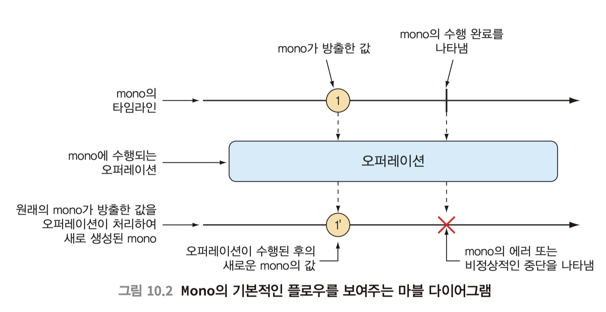

# Reactor


## Reactor?

리액터란 리액티브 스트림을 구현하는 라이브러리이며 Flux 와 Mono 두가지 타입으로 스트림을 정의한다.

<br>

> Reactor is the reactive library of choice for Spring WebFlux. 
> It provides the Mono and Flux API types
> to work on data sequences of 0..1 (Mono) and 0..N (Flux)

<br>

리액티브 프로그래밍은 명령형 프로그래밍과는 다르게, 일련의 작업 단계를 기술하는 것이 아니라 데이터가 전달될 파이프라인을 구성하는 것이다. 그리고 이 파이프라인을 통해 데이터가 전달되는 동안 어떤 형태로든 변경 또는 사용될 수 있다. 

<br>

실세계에 비유
- 명령형 프로그래밍: 물풍선
*한 번에 모든 물을 담았다가 충격이 가해지는 순간에 의도한 목표를 전달*
그러나 물풍선은 한정된 용량을 가지므로 더 많은 사람들에게 (또는 동일인에게 더 넓은 범위로) 물세례를 퍼부으려면 물풍선의 수량을 늘려서 용량을 확장하는 수 밖에 없다.

- 리액티브 프로그래밍: 정원용 호스
*분무기 노즐로 흐르는 물줄기로 물을 전달*
특정 시점에서 정원용 호스의 용량은 한정될 수 있지만, 물을 계속 트는 동안에는 무한정이다. 
정원용 호스는 쉽게 확장될 수 있어서 가능한 많은 친구들에게 물세례를 줄 수 있다.

<br><br>

#### 예시 코드

**명령형 프로그래밍**

``` java
String name = "gngsn";
String capitalName = name.toUpperCase();
String greeting = "Hello, " + capitalName + "!";
System.out.println(greeting);
```
스레드에서 한 단계씩 차례대로 실행되며, 각 단계가 완료될 때까지 다음 단계로 이동하지 못하게 실행 중인 스레드를 막는다.

<br>

**리액티브 코드**

``` java
Mono.just("gngsn")
    .map(n -> n.toUpperCase())
    .map(cn ->  "Hello, " + cn + "!")
    .subscribe(System.out::println);
```

<br><br>

### 리액터 의존성

``` xml
<dependency>
    <groupId>io.projectreactor</groupId>
    <artifactId>reactor-core</artifactId>
</dependency>

```

<br><br>

## Reactor 종류

종류에는 Mono와 Flux가 있는데, 마블 다이어그램<small>marble diagram</small>을 통해 표현되곤 한다.


### Mono

Mono 는 0 또는 하나의 데이터 항목과 에러를 갖는다

<br>

<br>

### Flux

<br>

Flux 는 0 또는 하나 이상의 데이터 항목과 에러를 갖는다

<br>

<br>

Mono와 Flux는 500개 이상의 오퍼레이션이 있는데, 각 오퍼레이션은 아래와 같이 분류할 수 있다.

- 생성 오퍼레이션 creation operation
- 조합 오퍼레이션 combination operation
- 변환 오퍼레이션 transformation operation
- 로직 오퍼레이션 logic operation

<br><br>

### 타입 생성

#### 객체 -> 리액터

하나 이상의 객체를 `just()` 메서드를 사용해서 리액티브 타입을 생성할 수 있다.

> <pre>public <b>static</b> &lt;T&gt; Flux&lt;T&gt; just(T... data) { ... }</pre>

<br>

아래의 예시를 보면 `subscribe()` 가 있는데, 리액티브 타입을 전달받을 때 사용하는 메서드이다.

> <pre>Disposable subscribe(Consumer&lt;? super T&gt; consumer)</pre>

<br><br>

``` java
@Test
public void createFluxByJust() {
    Flux<String> fruitFlux = Flux
            .just("Apple", "Orange", "Grape", "Banana", "Strawberry");

    fruitFlux.subscribe(
            fruit -> System.out.println("fruit: " + fruit)
    );
}

/* Output
fruit: Apple
fruit: Orange
fruit: Grape
fruit: Banana
fruit: Strawberry
*/
```

<br><br>

#### 객체 -> 리액터

Iterable 객체, 자바 Stream 객체로부터 생성될 수도 있다.

<br>

``` java
@Test
public void createFluxByFromArray() {
    String[] fruits = new String[] {
            "Apple", "Orange", "Grape", "Banana", "Strawberry" };
    Flux<String> fruitFlux = Flux.fromArray(fruits);
}
```

<br>

결과 값은 위와 동일하다.

<br><br>

#### 새로운 리액터 객체

<br>

``` java
@Test
public void createAFlux_range() {
    Flux<Integer> intervalFlux = Flux.range(1, 5);
}
```

### 리액티브 타입의 메소드

- `mergeWith()` : 두 Flux 객체들의 조합
- `delayElements()`: 객체 방출 시간 딜레이
- `Flux.zip(<Flux>, <Flux>)`: 두 Flux 객체를 조합. (방출 시간 순서)
- `distinct()` 오퍼레이션은 중복 메시 지를 걸러낸다
- `map()` 오퍼레이션은 입력 메시지의 변 환을 수행하여 결과 스트림의 새로운 메 시지로 발행한다
- `flatMap()` : 오퍼레이션은 수행 도중 생성되는 임시 Flux를 사용해서 변환을 수행하므로 비동기 변환이 가능하다
- `collectList()` : 오퍼레이션은 입력 Flux가 방출한 모든 메시지를 갖는 List의 Mono를 생성한다.
- `collectMap()` : 오퍼레이션은 Map을 포함하 는 Mono를 생성한다. 이때 입력 Flux가 방출 한 메시지가 해당 Map의 항목으로 저장되며, 각 항목의 큸는 입력 메시지의 특성에 따라 추출된다
- `all()` : 모든 메시지가 조건을 충족하는지 확인할 수 있다.
- `any()` : 최소한 하나의 메시지가 조건을 충족 하는지 확인할 수 있다.


