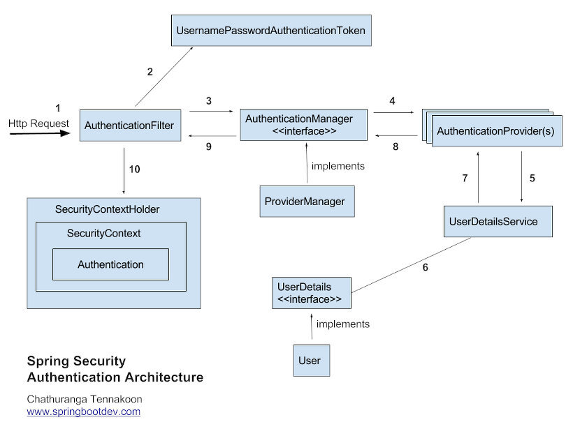
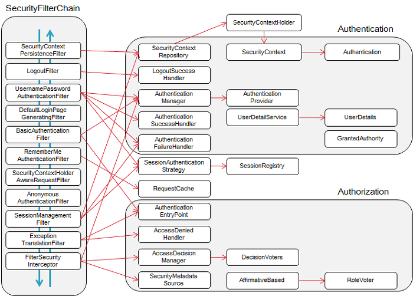

# Spring Security

Spring security에서는 기본적으로 세션 - 쿠키 방식을 사용

<br><br>

## 시큐리티 작동방식

<br>



<br>

- **UsernamePasswordAuthenticationToken** *class*
    
    ```java
    public class UsernamePasswordAuthenticationToken extends AbstractAuthenticationToken {
    
    	private static final long serialVersionUID = SpringSecurityCoreVersion.SERIAL_VERSION_UID;
    
    	private final Object principal;
    	private Object credentials;
    
    	public UsernamePasswordAuthenticationToken(Object principal, Object credentials) {
    		super(null);
    		this.principal = principal;
    		this.credentials = credentials;
    		setAuthenticated(false);
    	}
    
    	public UsernamePasswordAuthenticationToken(Object principal, Object credentials,
    			Collection<? extends GrantedAuthority> authorities) {
    		super(authorities);
    		this.principal = principal;
    		this.credentials = credentials;
    		super.setAuthenticated(true); // must use super, as we override
    	}
    
    	public Object getCredentials() {
    		return this.credentials;
    	}
    
    	public Object getPrincipal() {
    		return this.principal;
    	}
    
    	public void setAuthenticated(boolean isAuthenticated) throws IllegalArgumentException {
    		if (isAuthenticated) {
    			throw new IllegalArgumentException(
    					"Cannot set this token to trusted - use constructor which takes a GrantedAuthority list instead");
    		}
    
    		super.setAuthenticated(false);
    	}
    
    	@Override
    	public void eraseCredentials() {
    		super.eraseCredentials();
    		credentials = null;
    	}
    }
    ```
    
- **AuthenticationManager** *interface*
    
    
    ```java
    public interface AuthenticationManager {
    
    	/**
    	 * Attempts to authenticate the passed {@link Authentication} object, returning a
    	 * fully populated <code>Authentication</code> object (including granted authorities)
    	 * if successful.
    	 * <p>
    	 * An <code>AuthenticationManager</code> must honour the following contract concerning
    	 * exceptions:
    	 * <ul>
    	 * <li>A {@link DisabledException} must be thrown if an account is disabled and the
    	 * <code>AuthenticationManager</code> can test for this state.</li>
    	 * <li>A {@link LockedException} must be thrown if an account is locked and the
    	 * <code>AuthenticationManager</code> can test for account locking.</li>
    	 * <li>A {@link BadCredentialsException} must be thrown if incorrect credentials are
    	 * presented. Whilst the above exceptions are optional, an
    	 * <code>AuthenticationManager</code> must <B>always</B> test credentials.</li>
    	 * </ul>
    	 * Exceptions should be tested for and if applicable thrown in the order expressed
    	 * above (i.e. if an account is disabled or locked, the authentication request is
    	 * immediately rejected and the credentials testing process is not performed). This
    	 * prevents credentials being tested against disabled or locked accounts.
    	 *
    	 * @param authentication the authentication request object
    	 *
    	 * @return a fully authenticated object including credentials
    	 *
    	 * @throws AuthenticationException if authentication fails
    	 */
    	Authentication authenticate(Authentication authentication)
    			throws AuthenticationException;
    }
    ```
    
    ### 해석
    
    Authentication 객체를 인증하며, 성공 시 데이터가 채워진 Authentication 객체를 반환한다.
    
    Authentication Manager의 예외 처리는 아래의 규칙을 준수해야 한다.
    
    - 계정이 비활성화되어 있으면 LockedException를 던져야 하고, AuthenticationManager가 테스트할 수 있어야 한다
    - 계정이 잠겨 있으면 LockedException를 던져야 하고, AuthenticationManager가 테스트할 수 있어야 한다
    - 잘못된 자격 증명이 나타나면 BadCredentialsException를 던져야 한다. 이 예외는 옵션이지만 Authentication Manager는 항상 credential을 테스트할 수 있어야 한다.
    
    예외는 위의 순서대로 테스트할 수 있어야 하고, 해당하는 경우마다 예외처리되어야 한다.
    
    (만약, 계정이 disabled이거나 locked 이면,  인증 요청은 바로 거부되고 credentials testing은 실행되지 않는다.)
    
    이렇게 해야(순서를 지켜야) disabled이거나 locked 계정에 대해 자격 증명 테스팅 과정을 막을 수 있다.
    
    (→ 역자: 위의 순서가 지켜지지 않으면 disabled이거나 locked 계정에 대해 증명 과정이 실행되어 버린다. → 에러) 
    
    - **Authentication**  *interface*
        
        ```java
        public interface Authentication extends Principal, Serializable {
        
        	Collection<? extends GrantedAuthority> getAuthorities();
        
        	Object getCredentials();
        
        	Object getDetails();
        
        	Object getPrincipal();
        
        	boolean isAuthenticated();
        
        	void setAuthenticated(boolean isAuthenticated) throws IllegalArgumentException;
        }
        ```
        
    
- **AuthenticationProvider** *interface*
    
    
    ```java
    public interface AuthenticationProvider {
    
    		Authentication authenticate(Authentication authentication)
    		         throws AuthenticationException;
    		
    		boolean supports(Class<?> authentication);
    }
    ```
    
- **UserDetailsService** *interface*
    
    
    ```java
    public interface UserDetailsService {
    	UserDetails loadUserByUsername(String username) throws UsernameNotFoundException;
    }
    ```
    
- **UserDetails** *interface*
    
    ```java
    public interface UserDetails extends Serializable {
        Collection<? extends GrantedAuthority> getAuthorities();
    
        String getPassword();
    
        String getUsername();
    
        boolean isAccountNonExpired();
    
        boolean isAccountNonLocked();
    
        boolean isCredentialsNonExpired();
    
        boolean isEnabled();
    }
    ```
    
    | 메소드 | 리턴 타입 | 설명 |
    | --- | --- | --- |
    | getAuthorities() | Collection<? extends GrantedAuthority> | 계정의 권한 목록을 리턴 |
    | getPassword() | String | 계정의 비밀번호를 리턴 |
    | getUsername() | String | 계정의 고유한 값을 리턴
    ( ex : DB PK값, 중복이 없는 이메일 값 ) |
    | isAccountNonExpired() | boolean | 계정의 만료 여부 리턴 |
    | isAccountNonLocked() | boolean | 계정의 잠김 여부 리턴 |
    | isCredentialsNonExpired() | boolean | 비밀번호 만료 여부 리턴 |
    | isEnabled() | boolean | 계정의 활성화 여부 리턴 |
    

- **SecurityContextHolder** *class*
    
    
    ```java
    public class SecurityContextHolder {
    
    	public static final String MODE_THREADLOCAL = "MODE_THREADLOCAL";
    	public static final String MODE_INHERITABLETHREADLOCAL = "MODE_INHERITABLETHREADLOCAL";
    	public static final String MODE_GLOBAL = "MODE_GLOBAL";
    	public static final String SYSTEM_PROPERTY = "spring.security.strategy";
    	private static String strategyName = System.getProperty(SYSTEM_PROPERTY);
    	private static SecurityContextHolderStrategy strategy;
    	private static int initializeCount = 0;
    
    	static {
    		initialize();
    	}
    
    	public static void clearContext() {
    		strategy.clearContext();
    	}
    
    	public static SecurityContext getContext() {
    		return strategy.getContext();
    	}
    
    	public static int getInitializeCount() {
    		return initializeCount;
    	}
    
    	private static void initialize() {
    		if (!StringUtils.hasText(strategyName)) {
    
    			strategyName = MODE_THREADLOCAL;
    		}
    
    		if (strategyName.equals(MODE_THREADLOCAL)) {
    			strategy = new ThreadLocalSecurityContextHolderStrategy();
    		}
    		else if (strategyName.equals(MODE_INHERITABLETHREADLOCAL)) {
    			strategy = new InheritableThreadLocalSecurityContextHolderStrategy();
    		}
    		else if (strategyName.equals(MODE_GLOBAL)) {
    			strategy = new GlobalSecurityContextHolderStrategy();
    		}
    		else {
    			try {
    				Class<?> clazz = Class.forName(strategyName);
    				Constructor<?> customStrategy = clazz.getConstructor();
    				strategy = (SecurityContextHolderStrategy) customStrategy.newInstance();
    			}
    			catch (Exception ex) {
    				ReflectionUtils.handleReflectionException(ex);
    			}
    		}
    
    		initializeCount++;
    	}
    
    	public static void setContext(SecurityContext context) {
    		strategy.setContext(context);
    	}
    
    	public static void setStrategyName(String strategyName) {
    		SecurityContextHolder.strategyName = strategyName;
    		initialize();
    	}
    
    	public static SecurityContextHolderStrategy getContextHolderStrategy() {
    		return strategy;
    	}
    
    	public static SecurityContext createEmptyContext() {
    		return strategy.createEmptyContext();
    	}
    
    	@Override
    	public String toString() {
    		return "SecurityContextHolder[strategy='" + strategyName + "'; initializeCount="
    				+ initializeCount + "]";
    	}
    }
    ```
    
<br><br>


**접근 주체(Principal)**

보안 시스템이 작동되고 있는 애플리케이션에 접근하는 유저

<br>

**인증(Authentication)**

접근한 유저를 식별하고, 애플리케이션에 접근할 수 있는지 검사

<br>

**인가(Authorize)**

인증된 유저가 애플리케이션의 기능을 이용할 수 있는지 검사

<br><br>




<br>

**SecurityContextPersistenceFilter**

SecurityContextRepository에서 SecurityContext를 가져와 유저 Authentication에 접근 할 수 있게 한다.

<br>

**LogoutFilter**

로그아웃 요청을 처리한다.

<br>

**UsernamePasswordAuthenticationFilter**

ID와 Password를 사용하는 Form 기반 유저 인증을 처리한다.

<br>

**DefaultLoginPageGeneratingFilter**

커스텀 로그인 페이지를 지정하지 않았을 경우 Default Login Page를 반환한다.

<br>

**AnonymousAuthenticationFilter**

이 필터가 호출되는 시점까지 사용자 정보가 인증되지 않았다면 익명 사용자 토큰을 반환한다.

<br>

**ExceptionTranslationFilter**

필터 체인 내에서 발생되는 모든 예외(AccessDeniedException, AuthenticationException...)를 처리한다.

<br>

**FilterSecurityInterceptor**

권한부여와 관련한 결정을 AccessDecisionManager에게 위임해 권한부여 결정 및 접근 제어를 처리한다.

<br>

**RequestCacheAwareFilter**

로그인 성공 후, 이전 요청 정보를 재구성하기 위해 사용한다.

<br>

**SessionManagementFilter**

로그인 이후 인증된 사용자인지 확인하거나 설정된 Session 메커니즘에 따라 작업을 수행한다. (동시 로그인 확인 등...)

<br>

**BasicAuthenticationFilter**

HTTP 요청의 인증 헤더를 처리하여 결과를 SecurityContextHolder에 저장한다. (HttpBasic 방식)

<br>

**RememberMeAuthenticationFilter**

세션이 사라지거나 만료 되더라도 쿠키 또는 DB를 사용하여 저장된 토큰 기반으로 인증을 처리하는 필터