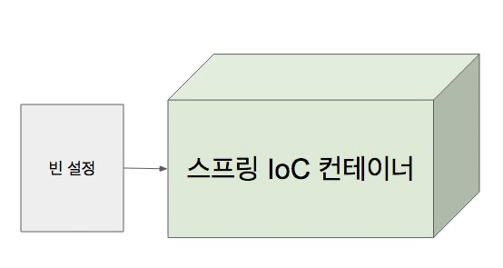

# IoC Container & Bean

## IoC 컨테이너 1부: 스프링 IoC 컨테이너와 빈

**Inversion of Control**

: 의존 관계 주입(Dependency Injection)

어떤 객체가 사용하는 의존 객체를 직접 만들어 사용하는게 아니라, 주입 받아 사용하는 방법을 말 함.

```java
public class BookService {

	// 이게 아니라
	// private BookRepository bookRepository = new BookRepository();
		private BookRepository bookRepository;
}

public class BookRepository {}

public class BookServiceTest {
		@Test
		public void save() {
			BookRepository bookRepository = new BookRepository();
			BookService bookService = new BookService(bookRepository);
		}
}

```

### 스프링 IoC 컨테이너

✔️ [BeanFactory](https://docs.spring.io/spring-framework/docs/5.0.8.RELEASE/javadoc-api/org/springframework/beans/factory/BeanFactory.html)

✔️ 애플리케이션 컴포넌트의 중앙 저장소.

✔️ 빈 설정 소스로 부터 빈 정의를 읽어들이고, 빈을 구성하고 제공한다.

여러 개발자들이 스프링 커뮤니티에서 논의후 만들어놓은 노하우, Best Practice등이 쌓여있는 기술이기 때문임

실제 초기에는 xml로 설정하다가 여러 개발자들의 의견을 받아 Annotation 형태로 변경되기도 했죠.

### Bean

*스프링 IoC 컨테이너가 관리 하는 객체.*

**장점 (빈으로 등록되면 좋은)**

✔️ 의존성 관리

✔️ 스코프 

**싱글톤**: 한 개의 객체를 공유

**프로포토타입**: 매번 다른 객체

✔️ 라이프사이클 인터페이스

IoC 컨테이너의 가장 최상단 인터페이스는 `BeanFactory`: IoC 컨테이너의 **핵심**.

BeanFactory LifeCycle들이 나와있음.

- **BeanFactory LifeCycle**
    
    Bean factory implementations should support the standard bean lifecycle interfaces as far as possible. The full set of initialization methods and their standard order is:
    
    1. BeanNameAware's `setBeanName`
    2. BeanClassLoaderAware's `setBeanClassLoader`
    3. BeanFactoryAware's `setBeanFactory`
    4. EnvironmentAware's `setEnvironment`
    5. EmbeddedValueResolverAware's `setEmbeddedValueResolver`
    6. ResourceLoaderAware's `setResourceLoader` (only applicable when running in an application context)
    7. ApplicationEventPublisherAware's `setApplicationEventPublisher` (only applicable when running in an application context)
    8. MessageSourceAware's `setMessageSource` (only applicable when running in an application context)
    9. ApplicationContextAware's `setApplicationContext` (only applicable when running in an application context)
    10. ServletContextAware's `setServletContext` (only applicable when running in a web application context)
    11. `postProcessBeforeInitialization` methods of BeanPostProcessors
    12. InitializingBean's `afterPropertiesSet`
    13. a custom init-method definition
    14. `postProcessAfterInitialization` methods of BeanPostProcessors

의존성주입이 되는 조건이 빈으로 등록되는 것.

북 서비스 인스턴스는 굳이 여러개 만들어서 사용하는 것이 아니기 때문에 싱글톤으로 사용

→ 싱글톤으로 사용되면 자원 절약에 도움. 스프링 IoC를 사용되면 좋은 이유 중 하나

→ 기본적으로 Singleton scope으로 생성됨 → 따라서 사용되는 객체들은 하나의 같은 객체

빈으로 등록 되었을 때 추가적인 작업을 하고 싶다?

아래와 같이 인터페이스 갖다 쓰자

```java
@PostConstruct
public void postConstruct() {
    System.out.println("====== CREATE BOOK SERVICE BEAN ======");
}

// Run Terminal에 출력됨
```

### ApplicationContext

[🔗 Link](https://docs.spring.io/spring-framework/docs/5.0.8.RELEASE/javadoc-api/org/springframework/context/ApplicationContext.html)

✔️ BeanFactory 와 함께 다양한 인터페이스를 상속받음

✔️ 메시지 소스 처리 기능 (i18n)

✔️ 이벤트 발행 기능

✔️ 리소스 로딩 기능

✔️ ...

## IoC 컨테이너 2부 : ApplicationContext와 다양한 빈 설정 방법



### 스프링 IoC 컨테이너의 역할

✔️ 빈 인스턴스 생성
✔️ 의존 관계 설정
✔️ 빈 제공

### AppcliationContext

✔️ ClassPathXmlApplicationContext (XML)
✔️ AnnotationConfigApplicationContext (Java)

### 빈 설정

✔️ 빈 명세서
✔️ 빈에 대한 정의를 담고 있다. (이름, 클래스, 스코프, 생성자 아규먼트 (constructor), 프로퍼트 (setter) , ..)

### 컴포넌트 스캔

✔️ 설정 방법

- XML 설정에서는 context:component-scan
- 자바 설정에서 @ComponentScan

✔️ 특정 패키지 이하의 모든 클래스 중에 @Component 애노테이션을 사용한 클래스를 빈으로 자동으로 등록 해 줌.

```java
@Configuration
public class ApplicationConfig {

    @Bean
    public BookRepository bookRepository() {
        return new BookRepository();
    }

    @Bean
    public BookService bookService() {
        return new BookService();
    }
}
```

이렇게 일일히 `@Bean` 을 적어주었었는데, XML의 component-scan으로 생략할 수 있게됨.

하지만, 현재 SpringBoot와 더 가깝게, Annotation으로 처리할 수 있음

```java
@Configuration
@ComponentScan(basePackageClasses = SpringCoreApplication.class)
public class ApplicationConfig {}
```

`SpringCoreApplication` 이 위치한 곳부터 컨포넌트 스캐닝을 해라

Annotation들을 찾아서 Bean으로 등록하는 기능

실제로, 메인 애플리케이션 Annotation 중 `@SpringBootApplication` 를 확인해보면

```java
@Target({ElementType.TYPE})
@Retention(RetentionPolicy.RUNTIME)
@Documented
@Inherited
@SpringBootConfiguration
@EnableAutoConfiguration
@ComponentScan(
    excludeFilters = {@Filter(
    type = FilterType.CUSTOM,
    classes = {TypeExcludeFilter.class}
), @Filter(
    type = FilterType.CUSTOM,
    classes = {AutoConfigurationExcludeFilter.class}
)}
)
public @interface SpringBootApplication { ... }
```

위와 같이 `@ComponentScan` 이 등록되어 있음

또, `@SpringBootConfiguration` 이 등록되어 있음 (`@Configuration`을 가짐)

그래서 `SpringCoreApplication` 가 사실상 `Bean` 설정 파일임 

(따로 ApplicationContext를 상속받지 않고 사용할 수 있는 SpringBoot가 지원해주는 기능인것임. → Spring 이 아니라 Boot!)

---

## IoC 컨테이너 3부: @Autowire

필요한 의존 객체의 “타입"에 해당하는 빈을 찾아 주입한다.

### 📌  @Autowired

✔️ required: 기본값은 true (따라서 못 찾으면 애플리케이션 구동 실패)

### 📌 사용할 수 있는 위치

[Github Link 참조](https://github.com/gngsn/Gngsn-Spring-Lab/blob/b817785d61a4fd5289f3dfd2f9fef79bd9d44892/spring-framework-core/spring-core/src/main/java/com/gngsn/springcore/book/BookService.java)

✔️ 생성자 (스프링 4.3 부터는 생략 가능)

✔️ 세터

✔️ 필드

### 생성자

```java
@Service
public class BookService {

    private BookRepository bookRepository;

    @Autowired
    public BookService(BookRepository bookRepository) {
        this.bookRepository = bookRepository;
    }
}
```

### Setter

```java
@Service
public class BookService {

    private BookRepository bookRepository;

		@Autowired
    public void setBookRepository(BookRepository bookRepository) {
        this.bookRepository = bookRepository;
    }
}
```

아래의 상황에서는 문제 X

```java
@Repository
public class BookRepository {}
```

Bean으로 등록되지 않기 때문에 ERROR

```java
public class BookRepository {}
```

Setter 주입이지만 에러가 난다.

→ 적어도 BookService 자체 인터페이스는 생성할 수는 있지만, 이 빈을 만들 때 Autowired를 하라고 했기 때문에 자동으로 생성하면서 에러를 발생

빈 의존성 주입을 필수가 아닌 상태로 빌드하려면 아래와 같이 사용 

의존성 주입이 안된 상태로 빌드가 된 것. 

```java
@Autowired(required = false)
public class BookRepository {}
```

### 경우의 수

✔️ 해당 타입의 빈이 없는 경우

✔️ 해당 타입의 빈이 한 개인 경우

✔️ 해당 타입의 빈이 여러 개인 경우

- 빈 이름으로 시도,
    - 같은 이름의 빈 찾으면 해당 빈 사용
    - 같은 이름 못 찾으면 실패
    

### 📌 같은 타입의 빈이 여러개 일 때

- *상황*
    
    ```java
    public interface BookRepository {}
    
    @Repository
    public class FirstBookRepository 
    implements BookRepository {}
    
    @Repository
    public class SecondBookRepository 
    implements BookRepository {}
    ```
    
    ```java
    @Service
    public class BookService {
        @Autowired
        private BookRepository bookRepository;
    }
    ```
    
    위와 같이 두 개의 Bean이 발견되면? →  아래와 같은 ERROR
    
    ```bash
    Field bookRepository in ....BookService required a single bean, but 2 were found:
    	- firstBookRepository: defined in file ...
    	- secondBookRepository: defined in file ...
    
    Action:
    Consider marking one of the beans as @Primary, updating the consumer to accept multiple beans, or using @Qualifier to identify the bean that should be consumed
    ```
    

- ✔️ @Primary  ← 아래보다 Typesafe, 추천
    
    ```java
    @Repository @Primary
    public class FirstBookRepository 
    implements BookRepository {}
    ```
    
- ✔️ @Qualifier (빈 이름으로 주입)
    
    ```java
    @Service
    public class BookService {
    
        @Autowired @Qualifier("firstBookRepository")  // 주입하고자 하는 객체 클래스의 카멜케이스 주입
        private BookRepository bookRepository;
    }
    ```
    
- ✔️ 해당 타입의 빈 모두 주입 받기
    
    ```java
    @Service
    public class BookService {
    
        @Autowired
        private List<BookRepository> bookRepository;
    
        public void print() {
            this.bookRepository.forEach(System.out::println);
        }
    ```
    

- ✔️ 이름으로 불러오기 (추천 X)
    
    사실 Autowired 는 타입도 보고 이름도 본다. 
    
    ```java
    @Service
    public class BookService {
        @Autowired
        private BookRepository firstBookRepository;   
    		// bookRepository : class com.gngsn.springcore.book.FirstBookRepository
    }
    ```
    

### 📌 동작 원리

✔️ 첫시간에 잠깐 언급했던 빈 라이프사이클 기억하세요?

✔️ [BeanPostProcessor](https://docs.spring.io/spring-framework/docs/current/javadoc-api/org/springframework/beans/factory/config/BeanPostProcessor.html)

- 새로 만든 빈 인스턴스를 수정할 수 있는 라이프 사이클 인터페이스

```java
@PostConstruct
public void setUp() {}

// BeanPostProcessor의 구현체에 의해 동작한다.
// 빈을 initialization (만든다음)한 다음에 초기화
// initialization Lifecycle 이전과 이후에 작업을 할 수 있는 callback이 존재
```

✔️ [AutowiredAnnotationBeanPostProcessor](https://docs.spring.io/spring-framework/docs/current/javadoc-api/org/springframework/beans/factory/annotation/AutowiredAnnotationBeanPostProcessor.html) extends BeanPostProcessor

- 스프링이 제공하는 @Autowired와 @Value 애노테이션 그리고 JSR-330의 @Inject 애노테이션을 지원하는 애노테이션 처리기.

[🔗 Github Link](https://github.com/gngsn/Gngsn-Spring-Lab/blob/89521031733efcce81b58bea46db0a4303ab502a/spring-framework-core/spring-core/src/main/java/com/gngsn/springcore/book/BookServiceRunner.java) 

`BeanFactory` 가 자기 안에 등록되어있는 `BeanPostProcessor` 들을 찾는다.

그 중 하나는 AutowiredAnnotationBeanPostProcessor 가 등록이 되어있는 거죠.

찾아서 다른 일반적인 `Bean` 들에게 `BeanPostProcessor` 를 적용하는 것.

---

 

## IoC 컨테이너 4부: @Component와 컴포넌트 스캔

### 컨포넌트 스캔 주요 기능

✔️ 스캔 위치 설정

✔️ 필터: 어떤 애노테이션을 스캔 할지 또는 하지 않을지

### @Component

✔️ @Repository

✔️ @Service

✔️ @Controller

✔️ @Configuration

위의 어노테이션으로 Bean으로 등록할 수 있고, ComponentScan을 통해 가능하다고 했는데, 그 동작원리를 알아보자

스프링 3.1부터 도입

```java
@Retention(RetentionPolicy.RUNTIME)
@Target({ElementType.TYPE})
@Documented
@Repeatable(ComponentScans.class)
public @interface ComponentScan {
		...
		/* ComponentScan: 가장 중요한 설정이 바로 basePackage
		*  String[]     : 문자열이 Typesafe 하지 않으니 Class를 사용할 수 있음 
		*  Class<?>[]   : 전달된 Class 기준으로 ComponentScan을 시작
		*/

		String[] basePackage() default {};

		Class<?>[] basePackageClasses() default {};
		...
}
```

그래서 ProjecctNameApplication(main을 포함한 초기 생성되는 클래스)을 기준으로 스캔을 하는데, 

그래서 패키지 밖의 클래스 혹은 다른 패키지들은 Scan이 안되어서 Bean이 생성되지 않고, Autowired가 불가능하게 되는 것.

### 동작 원리

✔️ @ComponentScan은 스캔할 패키지와 애노테이션에 대한 정보

✔️ 실제 스캐닝은 **[ConfigurationClassPostProcessor](https://docs.spring.io/spring-framework/docs/current/javadoc-api/org/springframework/context/annotation/ConfigurationClassPostProcessor.html)**라는 [BeanFactoryPostProcessor](https://docs.spring.io/spring-framework/docs/current/javadoc-api/org/springframework/beans/factory/config/BeanFactoryPostProcessor.html)에 의해 처리 됨.

BeanPostProcessor와 비슷하긴 한데, 실행되는 시점이 다름

다른 모든 빈들이 만드는 시점 이 전에 컴포넌트 스캔을 해서 빈으로 등록해준다.

이 Component Bean 들은 Singleton Scope으로 초기에 다 생성이 됨

그래서 등록해야할 빈이 많은 경우에 초기 구동 시간이 오래걸릴 수 있음

→ Functional을 사용한 Bean 등록방법은 구동 타임 관점에서 성능 상의 이점이 있음

static, builder, instance를 만들어서 생성하는 3가지 방법이 있음.

- Functional을 사용한 빈 등록 - builder
    
    ```java
    public static void main(String[] args) {
        new SpringApplicationBuilder()
                .sources(SpringCoreApplication.class)
                .initializers(
                        (ApplicationContextInitializer<GenericApplicationContext>) applicationContext -> {
                            applicationContext.registerBean(MyBean.class);
                        })
                .run(args);
    }
    ```
    

[🔗 Github Link](https://github.com/gngsn/Gngsn-Spring-Lab/blob/89521031733efcce81b58bea46db0a4303ab502a/spring-framework-core/spring-core/src/main/java/com/gngsn/springcore/SpringCoreApplication.java)

```java
// Functional Bean 생성 - Instance

@SpringBootApplication
public class SpringCoreApplication {

    // GenericApplicationContext.registerBean
    // -> ComponentScan 범위 밖의 패키지를 Bean으로 등록해서 Autowired 가능하게 만듦
    @Autowired
    MyService myService;

    public static void main(String[] args) {
        SpringApplication app = new SpringApplication(SpringCoreApplication.class);
        // 구동 전 실행하고 싶은 게 있다면 addInitializers
        app.addInitializers((ApplicationContextInitializer<GenericApplicationContext>) ctx -> {
            ctx.registerBean(MyService.class);
            ctx.registerBean(ApplicationRunner.class, 
                    () -> args1 -> System.out.println("Functional Bean Definition"));
        });
        app.run(args);
    }
}

```

---

 

## IoC 컨테이너 5부: 빈의 스코프

### 스코프

✔️ 싱글톤

✔️ 프로토타입

- Request

- Session

- WebSocket

- ...

```java
@Component
public class AppRunner implements ApplicationRunner {
    @Autowired
    ApplicationContext ctx;

    @Override
    public void run(ApplicationArguments args) throws Exception {
        System.out.println("\n\nproto");
        System.out.println(ctx.getBean(Proto.class));
        System.out.println(ctx.getBean(Proto.class));
        System.out.println(ctx.getBean(Proto.class));

        System.out.println("\n\nsingle");
        System.out.println(ctx.getBean(Single.class));
        System.out.println(ctx.getBean(Single.class));
        System.out.println(ctx.getBean(Single.class));
    }
}

/*
proto
com.gngsn.springcore.beanScope.Proto@39fa1df
com.gngsn.springcore.beanScope.Proto@30d50687
com.gngsn.springcore.beanScope.Proto@18d709d9

single
com.gngsn.springcore.beanScope.Single@25a17c29
com.gngsn.springcore.beanScope.Single@25a17c29
com.gngsn.springcore.beanScope.Single@25a17c29
*/

```

**프로토타입 빈이 싱글톤 빈을 참조하면?**

→ 아무 문제 없음.

**싱글톤 빈이 프로토타입 빈을 참조하면?**

✔️ 프로토타입 빈이 업데이트가 안되네?

- code
    
    ```java
    @Component
    public class AppRunner implements ApplicationRunner {
        @Autowired
        ApplicationContext ctx;
    
        @Override
        public void run(ApplicationArguments args) throws Exception {
            System.out.println("\n\nproto");
            System.out.println(ctx.getBean(Proto.class));
            System.out.println(ctx.getBean(Proto.class));
            System.out.println(ctx.getBean(Proto.class));
    
            System.out.println("\nsingle");
            System.out.println(ctx.getBean(Single.class));
            System.out.println(ctx.getBean(Single.class));
            System.out.println(ctx.getBean(Single.class));
    
            System.out.println("\nproto in single");
            System.out.println(ctx.getBean(Single.class).getProto());
            System.out.println(ctx.getBean(Single.class).getProto());
            System.out.println(ctx.getBean(Single.class).getProto());
        }
    }
    /*
    proto
    com.gngsn.springcore.beanScope.Proto@26969e08
    com.gngsn.springcore.beanScope.Proto@6d82d512
    com.gngsn.springcore.beanScope.Proto@6d9df54e
    
    single
    com.gngsn.springcore.beanScope.Single@267a7053
    com.gngsn.springcore.beanScope.Single@267a7053
    com.gngsn.springcore.beanScope.Single@267a7053
    
    proto in single
    **com.gngsn.springcore.beanScope.Proto@25ddc048
    com.gngsn.springcore.beanScope.Proto@25ddc048
    com.gngsn.springcore.beanScope.Proto@25ddc048**
    */
    ```
    

✔️ 업데이트 하려면

- scoped-proxy
    
    ```java
    @Component @Scope(value = "prototype", proxyMode = ScopedProxyMode.TARGET_CLASS)
    public class Proto {}
    // 모든 Single 내 Proto가 변경됨
    ```
    
- Object-Provider
    
    ```java
    @Component
    public class Single {
        @Autowired
        ObjectProvider<Proto> proto;
    
        public Proto getProto() {
            return proto.getIfAvailable();
        }
    }
    ```
    

- Provider (표준)

### 프록시

[Proxy_pattern](https://en.wikipedia.org/wiki/Proxy_pattern)


Prototype을 매번 바꿔줘야 하니까 Proxy로 감싼다.

`ScopedProxyMode.TARGET_CLASS` **는 ****Class 기반의 프록시**를 생성해서 실제 인스턴스(Proto)를 감싸는 프록시 인스턴스(Proxy)를 만들고, 

이 프록시 인스턴스를 Bean으로 등록한다.

### 싱글톤 객체 사용시 주의할 점

✔️ 프로퍼티가 공유.

✔️ ApplicationContext 초기 구동시 인스턴스 생성.

→ Thread Safe하게 제작해야함