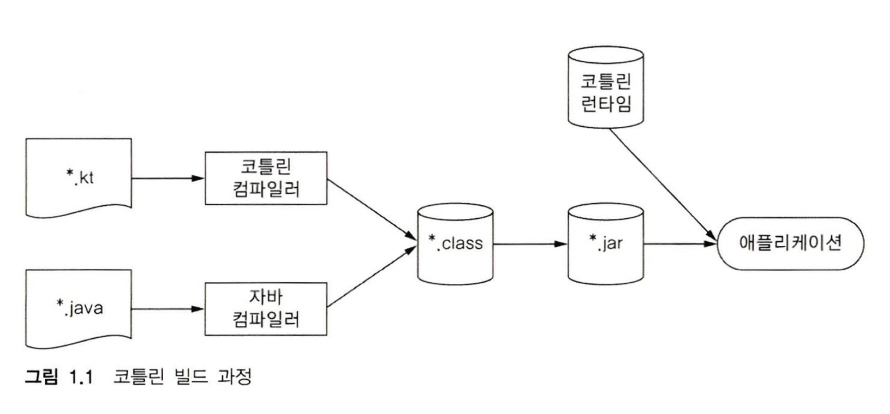

# Chapter 1.

## 주요 특성

1. Target Platform

Kotlin의 주목적; 현재 자바가 사용되고 있는 모든 용도에 적합하면서도 더 간결하고 생산적이며 안전한 대체 언어를 제공

- 서버상의 코드(특히 웹 애플리케이션의 Backend)
- 안드로이드 디바이스에서 실행되는 모바일 애플리케이


## 1.2. 정적 언어

**정적 타입*statically typed* 지정 언어**

코틀린은 자바와 동일하게 정적 타입.


**정적 타입 지정?**

- 모든 프루그램 구성 요소의 타입을 컴파일 시점에 알 수 있고 프로그램 안에서 객체 의 필드field나 메소드method를 사용할 때마다 컴파일러가 타입을 검증

↔ 동적 타입 dynamically typed (ex. Groovy, JRuby):
  - 타입과 관계없이 모든 값을 변수에 넣을 수 있음 + 메소드나 필드 접근에 대한 검증이 실행 시점에 발생
    - 코드가 더 짧아지고 데이터 구조를 더 유연하게 생성하고 사용할 수 있음
  - 하지만, 오타의 경우도 컴파일 시 걸러내지 못하고 실행 시점에 오류가 발생


### 변수의 타입 생략 가능
- 대부분의 경우 코틀린 컴파일러가 문맥으로부터 자동 유추


<br/><br/>

## 코틀린 코드 컴파일

코틀린은 .kt라는 확장자를 가짐.
코틀린 컴파일러는 자바 컴파일러가 자바 소스코드를 컴파일할 때와 마찬가지로 코틀린 소스코드를 분석해서 .class 파일을 만들어냄.
만들어진 .class 파일은 개발 중인 애플리케이션의 유형에 맞는 표준 패키징 과정을 거쳐 실행될 수 있음.


가장 간단한 방식은 커맨드라인에서 kotlinc 명령을 통해 코틀린 코드를 컴파일한 다음 java 명령으로 그 코드를 실행할 수 있다.

``` kotlin
kotlinc ＜소스파일 또는 디렉터리＞ -include-runtime —d ＜jar 이름＞
java -jar ＜jar 이름＞
```

<br/><br/>



코틀린 컴파일러로 컴파일한 코드는 코틀린 런타임 라이브러리kotlin runtime library에 의존.
런타임 라이브러리에는 코틀린 자체 표준 라이브러리 클래스와 코틀린에서 자바 API의 기능을 확장한 내용이 포함
코틀린으로 컴파일한 애플리케이션을 배포할 때는 런타임 라이브러리도 함께 배포해야 한다.

프로젝트를 컴파일하기 위해 메이븐Maven, 그레이들Gradle, 앤트Ant 등의 빌드 시스템을 사용할 수 있다.


### 대화형 셸

간단한 코틀린 코드 테스트는 대화형 셸을 사용할 수 있음.
대화형 셸을 REPL(입력을 받아 값을 계산한 다음 결과 값을 출력하는 루프, Read-Eval-Print Loop）이라고도 부른다.
REPL에서 코틀린 코드를 한 줄 입력하면 즉시 그 코드를 실행한 결과를 볼 수 있다.
REPL을 시작하려면 kotlinc 명령을 아무 인자 없이 실행하거나 인텔리J 아이디어 플러그인의 메뉴(툴Tool > 코틀린 > 코틀린 REPL）를 사용하면 된다.


