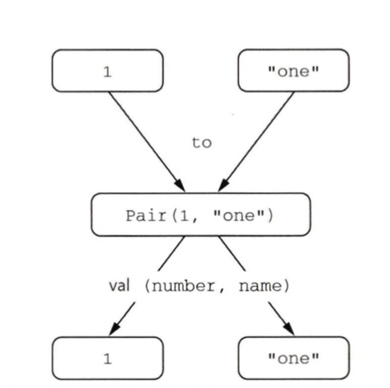

# Chapter 3.

## Create Collection

```kotlin
val set = hashSetOf(1, 7, 53)
val list = arrayListOf<Number>(1, 7, 53)
val map = hashMapOf<Number, String>(1 to "one", 7 to "seven", 53 to "fifty-three")

println(set.javaClass)  // class java.util.HashSet
println(list.javaClass) // class java.util.ArrayList
println(map.javaClass)  // class java.util.HashMap
```

* `.javaClass`는 자바 getClassO에 해당하는 코틀린 코드

`arrayListOf` 의 정의를 대표적으로 보면 Java ArrayList를 생성하는 wrapper

```kotlin
public fun <T> arrayListOf(vararg elements: T): ArrayList<T> =
    if (elements.size == 0) ArrayList() else ArrayList(ArrayAsCollection(elements, isVarargs = true))
```

**FYI. `to` 는 일반 함수**

> Tuples.kt
> `public infix fun <A, B> A.to(that: B): Pair<A, B> = Pair(this, that)`

<br/>

## Call Function

이름 붙인 인자

```kotlin
fun <T> joinToString(
    collection: Collection<T>,
    sep: String,
    prefix: String,
    postfix: String
): String {
    val result = StringBuilder(prefix)

    for ((index, element) in collection.withIndex()) {
        if (index > 0) result.append(sep)
        result.append(element)
    }

    result.append(postfix)
    return result.toString()
}
```
제네릭 함수의 문법은 자바와 비슷

문제1. 호출 가독성

`joinToString(collection, " ", " ", "."`

함수의 시그니처를 살펴보지 않고는 구별하기 어려움

함수 시그니처를 외우거나 IDE가 함수 시그니처를 표시해서 도움을 줄 수는 있겠지만, 함수 호출 코드 자체는 여전히 모호

```java
/* 자바 */
joinToString（collection, 
    /* separator */ " ”, 
    /* prefix */ " ", 
    /* postfix */ " . ”）;
```

```kotlin
joinToString(list, sep = " ", prefix = " ", postfix = ".")
```

호출 시 인자 중 어느 하나라도 이름을 명시하고 나면 혼동을 막기 위해 그 뒤에 오는 모든 인자는 이름을 꼭 명시해야 한다

자바로 작성한 코드를 호출할 때는 이름 붙인 인자를 사용할 수 없고, 반대로 JDK가 제공하는 함수를 호출할 때도 이름 붙인 인자를 쓸 수 없음. 
클래스 파일（.class 파일）에 함수 파라미터 정보를 넣는 것은 자바 8이후 추가된 선택적 특징인데, 코틀린은 JDK 6와 호환되기 때문.
코틀린 컴파일러는 함수 시그니처의 파라미터 이름을 인식할 수 없고, 호출 시 사용한 인자 이름과 함수 정의의 파라미터 이름을 비교할 수 없다.

```kotlin
list.ensureCapacity(minCapacity= 2) <-- java method: Named arguments are not allowed for non-Kotlin functions
```


### 디폴트 파라미터 값

자바에서는 일부 클래스에서 오버로딩0*10adm9한 메소드가 너무 많아진다는 문제
코틀린에서는 함수 선언에서 파라미터의 디폴트 값을 지정할 수 있으므로 이런 오버 로드 중 상당수를 피할 수 있다


```kotlin
fun <T> joinToString_usingDefault(
    collection: Collection<T>,
    sep: String = " ",
    prefix: String = "",
    postfix: String = ""
): String {
    val result = StringBuilder(prefix)

    for ((index, element) in collection.withIndex()) {
        if (index > 0) result.append(sep)
        result.append(element)
    }

    result.append(postfix)
    return result.toString()
}
```

대부분의 경우 아무 접두사나 접미사 없이 콤마로 원소를 구분한다. 따라서 그런 값을 디폴트로 지정
이제 함수를 호출할 때 모든 인자를 쓸 수도 있고, 일부를 생략할 수도 있음
```kotlin
// default parameter로 아래와 같이 시그니처를 생략해서 사용할 수 있고, 모두 동일한 결과를 나타냄
joinToString_usingDefault(list)
joinToString_usingDefault(list, " ")
joinToString_usingDefault(list, " ", "")
joinToString_usingDefault(list, " ", "", "")
```

이름을 붙이면 순서를 바꿔도 문제 없음
```kotlin
joinToString(list, "# 1, 2, 3;", postfix = "; ", prefix = "#") // # l, 2, 3;
```


디폴트 값과 자바 
자바에는 디폴트 파라미터 값이라는 개념이 없어서 코틀린 함수를 자바에서 호출하는 경우에는 그 코틀린 함수가 디폴트 파라미터 값을 제공하더라도 모든 인자를 명시해야 한다. 자바에서 코 틀린 함수를 자주 호출해야 한다면 자바 쪽에서 좀 더 편하게 코틀린 함수를 호출하고 싶을 것이 다. 그럴 때 @JvmOverloads 애노테이션을 함수에 추가할 수 있다. @JvmOverloads를 함수에 추가하면 코틀린 컴파일러가 자동으로 맨 마지막 파라미터로부터 파라미터를 하나씩 생략한 오버로딩한 자바 메소드를 추가해준다.

예를 들어 joinToString에 @JvmOverloads를 붙이면 다음과 같은 오버로딩한 함수가 만들어 진다.

```java
String joinToString(Collection<T> collection);
String joinToString(Collection<T> collection, String separator);
String joinToString(Collection<T> collection, String separator, String prefix);
String joinToString(Collection<T> collection, String separator, String prefix, String postfix) ;
```


### 정적인 유틸리티 클래스 없애기: 최상위 함수와 프로퍼티


자바에서는 모든 코드를 클래스의 메소드로 작성해야 하지만 어느 한 클래스에 포함시키기 어려운 코드가 많이 생긴다. 
그 결과 다양한 정적 메소드를 모아두는 역할만 담당하며, 특별한 상태나 인스턴스 메소드는 없는 클래스가 생겨난다. 


이 함수가 어떻게 실행될 수 있는 걸까? JVM이 클래스 안에 들어있는 코드만을 실행할 수 있기 때문에 컴파일러는 이 파일을 컴파일할 때 새로운 클래스를 정의해준다. 코틀린 만 사용하는 경우에는 그냥 그런 클래스가 생긴다는 사실만 기억하면 된다. 하지만 이 함수를 자바 등의 다른 JVM 언어에서 호출하고 싶다면 코드가 어떻게 컴파일되는지 알아야 joinToString과 같은 최상위 함수를 사용할 수 있다. 어떻게 코틀린이 join.kt 를 컴파일하는지 보여주기 위해 join.kt를 컴파일한 결과와 같은 클래스를 자바 코드로 써보면 다음과 같다.

```kotlin
// join.kt
package strings

fun <T> joinToString(
    collection: Collection<T>,
    sep: String,
    prefix: String,
    postfix: String
): String {
    val result = StringBuilder(prefix)

    for ((index, element) in collection.withIndex()) {
        if (index > 0) result.append(sep)
        result.append(element)
    }

    result.append(postfix)
    return result.toString()
}
```

```java
/* 자바 */
package strings;

public class JoinKt { // join.kt 파일에 해당하는 클래스
    public static String joinToString(...) {
        // ...
    }
}
```
코틀린 컴파일러가 생성하는 클래스의 이름은 최상위 함수가 들어있던 코틀린 소스 파일의 이름과 대응
따라서

자바에서 joinToString을 호출하기는 쉽다.

```java
import strings.JoinKt;

JoinKt.joinToString(list, ",", "", "");
```
파일에 대응하는 클래스의 이름 변경하기 코틀린 최상위 함수가 포함되는 클래스의 이름을 바꾸고 싶다면 파일에 @JvmName 애노테이션을 추가하라. @JvmName 애노테이션은 파일의 맨 앞, 패키지 이름 선언 이전에 위치해야 한다.

```kotlin
@file:JvmName("StringFunctions")      // 클래스 이름을 지정하는 애노테이션
package strings                         // @file：JvmName 에노테이션 뒤에 패키지 문이 와야 한다.

fun joinToString(...): String {...}
```

이제 다음과 같이 joinToString 함수를 호출할 수 있다.

```java
/* 자바 */

import strings.StringFunctions; 
StringFunctions.joinToString(list, ", ", "", "");
```

@JvmName 애노테이션의 문법에 대해서는 10장에서 설명한다.


### 최상위 프로퍼티

함수와 마찬가지로 프로퍼티도 파일의 최상위 수준에 놓을 수 있다. 어떤 데이터를 클래 스 밖에 위치시켜야 하는 경우는 흔하지는 않지만, 그래도 가끔 유용할 때가 있다.
const 변경자를 주가하면 프로 퍼티를 public static final 필드로 컴파일하게 만들 수 있다 (단, 원시 타입과 String 타입의 프로퍼티만 const로 지정할 수 있다).


이런 프로퍼티의 값은 정적 필드에 저장된다. 최상위 프로퍼티를 활용해 코드에 상수를 추가할 수 있다.

`val UNIX_LINE_SEPARATOR = "\n"`

기본적으로 최상위 프로퍼티도 다른 모든 프로퍼티처럼 접근자 메소드를 통해 자바 코드 에 노출(val의 경우 게터, var의 경우 게터와 세터가 생긴다). 겉으론 상수처럼 보이는데, 실제로는 게터를 사용해야 한다면 자연스럽지 못하다. 더 자연스럽게 사용하려면 이 상수를 `public static final` 필드로 컴파일해야 한다. `const` 변경자를 주가하면 프로 퍼티를 `public static final` 필드로 컴파일하게 만들 수 있다 (단, 원시 타입과 String 타입의 프로퍼티만 const로 지정할 수 있다).

`const val UNIX_LINE_SEPARATOR = "\n"`


### 확장 함수와 확장 프로퍼티

**기존 코드와 코틀린 코드를 자연스럽게 통합하는 것은 코틀린의 핵심 목표 중 하나**

완전히 코틀린으로만 이뤄진 프로젝트조차도 JDK나 안드로이드 프레임워크 또는 다른 서드파티 프레임워크 등의 자바 라이브러리를 기반으로 만들어진다. 
또 코틀린을 기존 자바 프로젝트에 통합하는 경우에는 코틀린으로 직접 변환할 수 없거나 미처 변환하지 않은 기존 자바 코드를 처리할 수 있어야 한다.


확장 함수
: 어떤 클래스의 멤버 메소드인 것처 럼 호출할 수 있지만 그 클래스의 밖에 선언된 함수
기존 자바 API를 재작성하지 않고도 코틀린이 제공하는 여러 편리한 기능을 사용할 수 있다


확장 함수를 만들려면 추가하려는 함수 이름 앞에 그 함수가 확장할 클래스의 이름을 덧붙이기만 하면 된다. 
클래스 이름을 수신 객체 타입receiver type이라 부르며, 확장 함수가 호출되는 대상이 되는 값(객체)을 수신 객체receiver object라고 부른다


```kotlin
package strings

fun String.lastChar(): Char = this.get(this.length - 1)
// String : receiver type
// this : receiver object

println("Kotlin".lastChar())    // this 생략 가능 
// "Kotlin" : receiver object
```

자바나 그루비와 같은 다른 JVM 언어로 작성된 클래스도 확장할 수 있다. 
자바 클래스로 컴파일한 클래스 파일이 있는 한 그 클래스에 원하는 대로 확장을 추가할 수 있다.

일반 메소드의 본문에서 this를 사용할 때와 마찬가지로 확장 함수 본문에도 this 를 쓸 수 있다. 
그리고 일반 메소드와 마찬가지로 확장 함수 본문에서도 this를 생략할 수 있다.

수신 객체의 메소드나 프로퍼티를 바로 사용할 수 있다. 
하지만 확장 함수가 캡슐화를 깨지는 않기 때문에 확장 함수 안에서는 클래스 내부에서만 사용할 수 있는 비공개private 멤버나 보호된protected 멤버를 사용할 수 없다


**임포트와 확장 함수**

확장 함수를 사용하기 위해서는 임포트해야만 한다. 
코틀린에서는 클래스를 임포트할 때와 동일한 구문을 사용해 개별 함수를 임포트할 수 있다.

```kotlin
import strings.lastChar
// or 
import strings.*

val c = "Kotlin".lastChar()
```

as 키워드를 사용하면 임포트한 클래스나 함수를 다른 이름으로 부를 수 있다.

```kotlin
import strings.lastChar as last

val c = "Kotlin".last()
```

한 파일 안에서 다른 여러 패키지에 속해있는 **이름이 같은 함수**를 가져와 사용해야 하는 경우 이름을 바꿔서 임포트하면 이름 충돌을 막을 수 있다. 
물론 일반적인 클래스나 함수라면 그 전체 이름(FQN, Fully Qualified Name)을 써도 된다. 하지만 코틀린 문법상 확장 함수 는 반드시 짧은 이름을 써야 한다. 따라서 임포트할 때 이름을 바꾸는 것이 확장 함수 이름 충돌을 해결할 수 있는 유일한 방법

**자바에서 확장 함수 호출**

내부적으로 확장 함수는 수신 객체를 첫 번째 인자로 받는 정적 메소드다. 
그래서 확장 함수를 호출해도 다른 어댑터adapter 객체나 실행 시점 부가 비용이 들지 않는다.

```java
char c = StringUtilKt.lastChar("Java");
```


```kotlin
fun <T> Collection<T>.joinToString(  //<----- Collection〈T〉 에 대한 확장 함수를 선언한다.
    separator: String = ", ",  //         파라미터의 디폴트 값을 지정한다.
    prefix: String = "",
    postfix: String = ""
): String {
    val result = StringBuilder(prefix)
    for ((index, element) in this.withIndex()) {
        if (index > 0) result.append(separator)
        result.append(element)
    }
    result.append(postfix)
    return result.toString()
}

// joinToString을 클래스의 멤버인 것처럼 호출할 수 있다.
val list = listOf<Number>(1, 2, 3)

list.joinToString() // "1, 2, 3"
list.joinToString(", ", postfix = ";", prefix = "# ") // "# 1, 2, 3;"
```

**타입 지정**
확장 함수는 단지 정적 메소드 호출에 대한 문법적인 편의syntatic sugar일 뿐이다. 
더 구체적인 타입을 수신 객체 타입으로 지정할 수도 있다. 
문자 열의 컬렉션에 대해서만 호출할 수 있는 join 함수를 정의하고 싶다면 다음과 같이 하면 된다.


```kotlin
fun Collection<String>.join(
    separator: String = ", ", 
    prefix: String = "",
    postfix: String = ""
) = joinToString(separator, prefix, postfix)

listOf("one", "two", "eight").join(" ")
// one two eight
```


```kotlin
listOf (1, 2, 8).join() // Error: Type mismatch: inferred type is List<Int> but Collection<String>
```

### 확장 함수는 override 대상이 아님

확장 함수는 클래스의 일부가 아니다. 확장 함수는 클래스 밖에 선언된다.

파라미터가 완전히 같은 확장 함수를 상위 클래스와 하위 클래스에 동시에 정의해도, 
**정적 타입**에 의해 어떤 확장 함수가 호출될지 결정된다.
즉, 멤버 메소드처럼 객체의 **동적인 타입에 의해 확장 함수가 결정되지 않는다**.

```kotlin
open class View {
    open fun click () = println ("View clicked")
}

class Button: View() {  //Button은 View를 확장한다.
    override fun click() = println("Button clicked")
}

fun View.showOff() = println ("I’m a view! ")
fun Button.showOff() = println ("I ’m a button! ")

val view: View = Button()
view.click()        // Button clicked. \ override function 호출하기 때문에 Button method 호출
view.showOff()      // I’m a view!     \ 확장 함수는 override 되지 않기 때문에 View method 호출
```


**확장 프로퍼티**

확장 프로퍼티를 사용하면 기존 클래스 객체에 대한 프로퍼티 형식의 구문으로 사용할

수 있는 API를 추가할 수 있다. 프로퍼티라는 이름으로 불리기는 하지만 상태를 저장할 적절한 방법이 없기 때문에(기존 클래스의 인스턴스 객체에 필드를 추가할 방법은 없다)실제로 확장 프로퍼티는 아무 상태도 가질 수 없다. 하지만 프로퍼티 문법으로 더 짧게 코드를 작성할 수 있어서 편한 경우가 있다.

```kotlin
val String.lastChar:Char get() = get(length - 1)
var StringBuilder.lastChar: Char
    get() = get(length - 1)
    set(value: Char) = this.setCharAt(length - 1, value)

println("Kotlin".lastChar)  // n

val sb = StringBuilder("Kotlin?")
sb.lastChar = '!'
println(sb.lastChar)        // !
```

자바에서 확장 프로퍼티를 사용하고 싶다면 항상 StringUtilKt.getLastChar("Java") 처럼 게터나 세터를 명시적으로 호출해야 한다.


## Working with collections
*: varargs, infix calls, and library support*

- vararg 키워드를 사용하면 호출 시 인자 개수가 달라질 수 있는 함수를 정의할 수 있다.
- 중위infix 함수 호출 구문을 사용하면 인자가 하나뿐인 메소드를 간편하게 호출할 수 있다.
- 구조 분해 선언destructuring declaration을 사용하면 복합적인 값을 분해해서 여러 변 수에 나눠 담을 수 있다.

### 자바 컬렉션 API 확장

코틀린 컬렉션은 자바와 같은 클래스를 사용하지만 더 확장된 API 를 제공한다. 

```kotlin
val strings:List<String> = listOf("first", "second", "fourteenth")
strings.last() // fourteenth

val numbers:Collection<Int> = setOf(1, 14, 2)
numbers.max()  // 14
```

last와 max는 모두 확장 함수

```kotlin
fun <T> List<T>.last() : T { /* 마지막 원소를 반환함 */ } 
fun Collection<Int>.max():Int { /* 컬렉션의 최댓값을 찾음 */ }
```

### 가변 인자 함수: 인자의 개수가 달라질 수 있는 함수 정의

리스트를 생성하는 함수를 호출할 때 원하는 만큼 많이 원소를 전달할 수 있다.

`val list = listOf (2, 5, 7, 11)`

라이브러리에서 이 함수의 정의를 보면 다음과 같다

`fun listOf<T> (vararg values:T):List<T> { ... }`

가변 길이 인자: 메소드를 호출할 때 원하는 개수만큼 값을 인자로 넘기면 자바 컴파일러가 배열에 그 값들을 넣어주는 기능
코틀린의 가변 길이 인자는 자바의 가변 길이 인자varargs와 비슷하다. 
다만 문법이 조금 다른데, 타입 뒤에 `...`를 붙이는 대신 코틀린에서는 파라미터 앞에 `vararg` 변경자를 붙인다.


이미 배열에 들어있는 원소를 가변 길이 인자로 넘길 때도 코틀린과 자바 구문이 다르다. 
자바에서는 배열을 그냥 넘기면 되지만 코틀린에서는 배열을 명시적으로 풀어 서 배열의 각 원소가 인자로 전달되게 해야 한다. 
기술적으로는 스프레드연산자가 그런 작업을 해준다. 하지만 실제로는 전달하려는 배열 앞에 `*`를 붙이기만 하면 된다

```kotlin
fun main(args: Array<String>) {
    val list = listOf("args: ", *args)  // 스프레드 연산자가 배열의 내용을 펼쳐준다.
    println(list) 
}
```

### 값의 쌍 다루기: 중위 호출과 구조 분해 선언

맵을 만들려면 mapOf 함수를 사용한다.

`val map = mapOf (1 to "one", 7 to "seven", 53 to ’’fifty-three")`

to라는 단어는 코틀린 키워드가 아니고, 중위 호출infix call 이라는 특별한 방식으로 to라는 일반 메소드를 호출한 것
**중위 호출** 시에는 수신 객체와 유일한 메소드 인자 사이에 메소드 이름을 넣는다.
(이때 객체, 메소드 이름, 유일한 인자 사이에는 공백이 들어가야 한다). 
다음 두 호출은 동일하다.

```kotlin
1. to ("one")       // "to" 메소드를 일반적인 방식으로 호출함
1 to "one"          // "to" 메소드를 중위 호출 방식으로 호출함
```

인자가 하나뿐인 일반 메소드나 인자가 하나뿐인 확장 함수에 중위 호출을 사용할 수 있다. 
함수(메소드)를 중위 호출에 사용하게 허용하고 싶으면 infix 변경자를 함수(메소드) 선언 앞에 추가해야 한다. 
다음은 to 함수의 정의를 간략하게 줄인 코드다.

`infix fun kny.to (other: Any) = Pair (this, other)`

이 to 함수는 Pair의 인스턴스를 반환한다. 
Pair는 코틀린 표준 라이브러리 클래스로, 그 이름대로 두 원소로 이뤄진 순서쌍을 표현한다. 
실제로 to는 제네릭 함수지만 여기서는 설명을 위해 그런 세부 사항을 생략했다.

Pair의 내용으로 두 변수를 즉시 초기화할 수 있다.

`val (number, name) = 1 to "one"`

이런 기능을 구조 분해 선언destructuring declaration이라고 부른다. 

Pair에 대해 구조 분해가 어떻게 작동하는지 보여준다.





key와 루프에서도 구조 분해 선언을 활용할 수 있다. 
joinToString에서 본 withIndex를 구조 분해 선언과 조합하면 컬렉션 원소의 인덱스와 값을 따로 변수에 담을 수 있다.

```kotlin
for ((index, element) in collection.withIndex()) {
    println("$index: $element")
}
```


to 함수는 확장 함수다. to를 사용하면 타입과 관계없이 임의의 순서쌍을 만들 수 있다. 이는 to의 수신 객체가 제네릭하다는 뜻이다. `1 to "one", "one" to 1, list to list.size()` 등의 호출이 모두 잘 작동한다. mapOf 함수의 선언을 살펴보자.

```kotlin
fun <K, V> mapOf(vararg values: Pair<K, V>) : Map<K, V>
```

listOf와 마찬가지로 mapOf에도 원하는 개수만큼 인자를 전달할 수 mapOf의 경우에는 각 인자가 키와 값으로 이뤄진 순서쌍이어야 한다.
코틀린을 잘 모르는 사람이 보면 새로운 맵을 만드는 구문은 코틀린이 맵에 대해 제공하는 특별한 문법인 것처럼 느껴진다. 하지만 실제로는 일반적인 함수를 더 간결한 구문으로 호출하는 것뿐이다. 이제는 확장을 통해 문자열과 정규식을 더 편리하게 다루 는 방법을 살펴본다.

