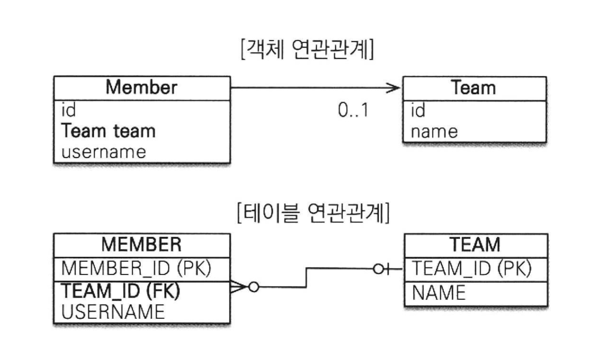

# Chapter 5. Mapping Basic (연관 관계 기초)

_목표: 객체의 참조와 테이블의 외래 키 매핑_

<br/>

_**Table of Content**_

- 단방향 연관관계
- 연관관계 사용
- 양방향 연관관계
- 연관관계의 주인
- 양방향 연관관계 저장
- 양방향 연관관계의 주의점

<br/>

**Terms**

#### ✔️ 방향 _Direction_

- 단방향: 회원과 팀이 관계가 있을 때 '회원 → 팀' 또는 '팀 → 회원' **둘 중 한 쪽만 참조**
- 양방향: '회원 → 팀', '팀 → 회원' **양쪽 서로 참조**

_방향은 객체 관계에만 존재하고 테이블 관계는 항상 양방향_

#### ✔️ 다중성 _Multiplicity_
- 다대일(N:1)
- 일대다(1:N)
- 일대일(1:1)
- 다대다(N:M)

#### ✔️ 연관관계의 주인 _Owner_
- 객체를 양방향 연관관계로 만들면 연관관계의 주인을 정해 야 한다.

<br/>

---

## 단방향 연관관계

#### TL;DR. ️객체 연관관계 vs 테이블 연관관계
- **객체**는 참조(주소)로 연관관계를 맺음
    - 참조 `a.getB().getC()` 를 사용
    - 객체의 연관관계는 **단방향**
      - 양방향으로 참조하려면 단방향 연관관계를2개 만들어야 함
      - A → B (`a.b`), B → A (`b.a`)
- **테이블**은 외래 키로 연관관계를 맺음
    - 조인 `join` 사용
    - 테이블의 연관관계는 **양방향**


#### 다대일(N:1), 단방향



<br/>

### 객체 연관관계

- 회원 객체와 팀 객체는 **단방향 관계**
- 회원 객체는 `Member.team` 필드(멤버변수)로 팀 객체와 연관관계를 맺음
  - **회원**은 **팀**을 알 수 있음: `Member.team` 필드 접근 
  - **팀**은 **회원**을 알 수 없음.

> 객체 연관관계와 테이블 연관관계의 가장 큰 차이는 객체 연관관계는 "양방향 관계가 아니라 서로 다른 단방향 관계 2개"로 구성한다는 것" 

<br/>

<table>
<tr><th>단방향 연관관계</th><th>양방향 연관관계</th></tr>
<tr><td>

```java
class B {
    A b;
}

class B {}
```
</td><td>

``` java
class A {
    B b;
}
class B {
    A a;
}
```

</td>
</tr></table>

#### Example) 순수한 객체 연관관계 

<table>
<tr>
<th>Objects</th>
<td>

```java
public class Member {
    private String id; 
    private String username;

    private Team team; // 팀의 참조를 보관

    public void setTeam(Team team) {
        this.team = team;
    }
    
    // Getter, Setter ...
}
```
</td>
<td>

```java
public class Team {
    private String id;
    private String name;

    // Getter, Setter ...
}
```

</td></tr>
<tr><th>Relationship</th>
<td colspan="2">
회원 1과 회원2를 팀 1에 소속

```java
public static void main(String[] args) {
    Member member 1 = new Member("member1", "회원");
    Member member2 = new Member("member2", "회원2");
    
    Team team1 = new Team("team1", "팀1");

    member1.setTeam(team1);
    member2.setTeam(team1);

    Team findTeam = member1.getTeam();
}
```

</td></tr></table>

<br/>

#### 테이블 연관관계

- 회원 테이블과 팀 테이블은 **양방향 관계**
- 회원 테이블은 `TEAM_ID` 외래 키로 팀 테이블과 연관관계를 맺음
- 회원 테이블의 `TEAM_ID` **외래 키**를 통해 회원과 팀을 조인할 수 있고 반대로 팀과 회원도 조인할 수 있음
    - `TEAM_ID` 외래 키로 `MEMBER JOIN TEAM` 과 `TEAM JOIN MEMBER`

<br/>


#### Example) 순수한 객체 연관관계

<table>
<tr>
<th>Objects</th>
<td>

```sql
CREATE TABLE MEMBER (
        MEMBER_ID VARCHAR(255) NOT NULL,,
        TEAM_ID VARCHAR(255),
        USERNAME VARCHAR(255),
        PRIMARY KEY (MEMBER_ID)
)
```
</td>
<td>

```sql
CREATE TABLE TEAM (
        TEAM_ID VARCHAR(255) NOT NULL,
        NAME VARCHAR(255),
        PRIMARY KEY (TEAM_ID)
)
```

</td></tr>
<tr><th>Relationship</th>
<td colspan="2">

```sql
ALTER TABLE MEMBER ADD CONSTRAINT FK_MEMBER_TEAM 
    FOREIGN KEY (TEAM_ID) 
    REFERENCES TEAM
```

```sql
INSERT INTO TEAM (TEAM_ID, NAME) VALUES ('team1', '팀1'); 
INSERT INTO MEMBER(MEMBER_ID, TEAM_ID, USERNAME) 
VALUES ('member1', 'team1', '회원1');
INSERT INTO MEMBER(MEMBER_ID, TEAM_ID, USERNAME) 
VALUES ('member2', 'team2', '회원2');
```

```sql
SELECT T.* 
FROM MEMBER M 
    JOIN TEAM T ON M.TEAM_ID = T.TEAM_ID 
WHERE M.MEMBER_ID = 'member1'
```

</td></tr></table>

<br/>

### 객체 관계 매핑


<table>
<tr>
<td>

```java
@Entity 
public class Member {

    @Id
    @Column(name = "MEMBER_ID")
    private String id;
    private String username;

    // 연관관계 매핑
    @ManyToOne  // 다대일(N:1) 관계를 나타내는 매핑 정보
    @JoinColumn(name = "TEAM_ID")   // 외래 키를 매핑할 때 사용
    private Team team;

    // 연관 관계 설정
    public void setTeam(Team team) {
        this.team = team;
    }

    // Getter, Setter ...
}
```

</td>
<td>

```java
public class Team {
    
    @Id
    @Column(name = "TEAM_ID")
    private String id;
    
    private String name;

    // Getter, Setter ...
}
```

</td></tr></table>

<br/>

### @JoinColumn

| 속성   | 기능                                            | 기본 값                                                                                                         |
|------|-----------------------------------------------|--------------------------------------------------------------------------------------------------------------|
| name | 매핑할 외래 키 이름                                   | 외래키 기본 전략 사용<br/> - 기본 키 컬럼명: "**_필드명_참조하는 테이블_**" <br/> - 필드명(team) + _ (밑줄) + 참조하는 테이블의 컬럼명(TEAM_ID) 👉🏻 `team_TEAM_ID` |
| referencedColumnName     | 외래 키가 참조하는 대상 테이블의 컬럼명                        | 참조하는 테이블의 기본 키 컬럼명                                                                                           |
| foreignKey(DDL)     | 외래 키 제약조건을 직접 지정할 수 있다. 이 속성은 테이블을 생성할 때만 사용한다. |                                                                                                              |
| unique <br/>nullable<br/> insertable<br/> updatable<br/> columnDefinition<br/> table     | @Column의 속성과 동일                               |                                                                                                              |

<br/>

#### @ManyToOne

다대일 관계에서 사용


| 속성           | 기능                                                          | 기본 값                                                           |
|--------------|-------------------------------------------------------------|----------------------------------------------------------------|
| optional     | false로 설정하면 연관된 엔티티가 항상 있어야 함                               | false                                                          | 
| fetch        | 글로벌 페치 전략을 설정                                               | - @ManyToOne=FetchType.EAGER <br/> - @OneToMany=FetchType.LAZY |
| cascade      | 영속성 전이 기능을 사용                                               |                                                                |
| targetEntity | 연관된 엔티티의 타입 정보를 설정. 거의 사용 안함. 컬렉션을 사용해도 제네릭으로 타입 정보를 알 수 있음<br/>Example)<br/> - `@OneToMany private List<Member> members;` → 제네릭으로 타입 정보를 알 수 있음.<br/>- `@OneToMany(targetEntity=Member.class) private List members;` 제네릭이 없으면 타입 정보를 알 수 없음.
  |                                                                |


<br/><br/>

## 연관관계 사용

### 조회

- 객체 그래프 탐색 (객체 연관관계를 사용한 조회)
- 객체지향 쿼리 사용 JPQL

**JPQL 조인 검색**

```java
private static void queryLogicJoin(EntityManager em) {
    String jpql = "select m from Member m join m.team t where " + "t.name=:teamName";

    List<Member> resultList = em.createQuery(jpql, Member.class)
        .setParameter("teamName", "팀1")
        .getResultList();

    for (Member member : resultList) {
        System.out.println("[query] member.username=" +
        member.getUsername());
    }
}
```

<br/>

### 수정

```java
private static void updateRelation(EntityManager em){
        // 새로운 팀2
        Team team2=new Team(nteam2”,”팀2”);em.persist(team2);

        // 회원1 에 새로운 팀2 설정
        Member member=em.find(Member.class,"member1");
        member.setTeam(team2);
}
```

- `em.update()` 같은 메소드가 없음
- 단순히 불러온 엔티티의 값만 변경해두면 **트랜잭션을 커밋**할 때 **플러시**가 일어나면서 변경 감지 기능 작동. 
- 그리고 변경사항을 데이터베이스에 자동으로 반영.

<br/>

### 연관관계 제거

```java
private static void deleteRelation(EntityManager em) {
    // 연관관계 제거
    Member member 1 = em.find(Member.class, "member1"); 
    member1.setTeam(null);
}
```

- 연관된 엔티티를 삭제하려면 기존에 있던 연관관계를 먼저 제거하고 삭제해야 함. (그렇지 않으면, 외래키 제약조건으로 인해 데이터베이스에서 오류가 발생)

```java
member1.setTeam(null); // 회원 1 연관관계 제거
member2.setTeam(null); // 회원 2 연관관계 제거
em.remove(team); // 팀 삭제
```

<br/>

## 양방향 연관관계

- [ch5.entity.twoway.Member Class 참고](../src/main/java/com/gngsn/ch5/entity/biDirection/Member.java)
- [ch5.entity.twoway.Team Class 참고](../src/main/java/com/gngsn/ch5/entity/biDirection/Team.java)

- 팀에서 회원으로 접근하는 관계를 추가

<br/>

## 연관관계의 주인

- 회원 컬렉션으로 객체 그래프 탐색을 사용해서 조회한 회원들을 출력


@OneToMany(mappedBy = "team")

#### 객체 연관관계

- 회원 → 팀 연관관계 1개 (단방향)
- 팀 → 회원 연관관계 1개 (단방향)

객체에는 양방향 연관관계라는 것이 없음.
서로 다른 단방향 연관관계 2개를 애플리케이션 로직으로 잘 묶어서 양방향인 것처럼 보이게 할 뿐.


#### 테이블 연관관계

- 회원 ↔ 팀의 연관관계 1개 (양방향)


- **연관관계의 주인**만 데이터베이스 연관관계와 매핑되고 + 외래 키를 관리 (등록, 수정, 삭제)할 수 있음
- **주인이 아닌 객체**는 읽기만 할 수 있음


#### mappedBy

- 어떤 연관관계를 주인으로 정할 때 사용하면 됨
- 주인은 mappedBy 속성을 사용하지 않는다.
- 주인이 아니면 mappedBy 속성을 사용해서 속성의 값으로 연관관계의 주인을 지 정해야 함


## 양방향 연관관계 저장

## 양방향 연관관계의 주의점