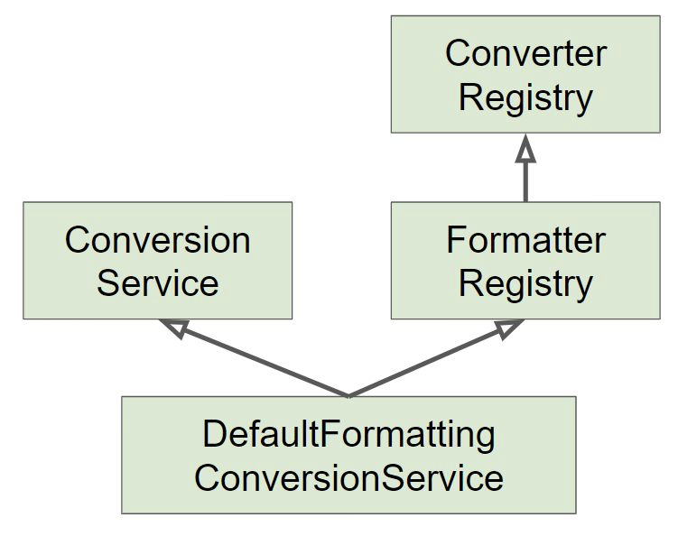

# DataBinding

## 데이터 바인딩 추상화: PropertyEditor

[org.springframework.validation.DataBinder](https://docs.spring.io/spring/docs/current/javadoc-api/org/springframework/validation/DataBinder.html)

**기술적인 관점**: 프로퍼티 값을 타겟 객체에 설정하는 기능

**사용자 관점**: 사용자 입력값을 애플리케이션 도메인 모델에 동적으로 변환해 넣어주는 기능.

**해석하자면**: 입력값은 대부분 “문자열”인데, 그 값을 객체가 가지고 있는 int, long, Boolean, Date 등 심지어 Event, Book 같은 도메인 타입으로도 변환해서 넣어주는 기능.

[PropertyEditor](https://docs.oracle.com/javase/7/docs/api/java/beans/PropertyEditor.html)

- code

    ```java
    @RestController
    public class EventController {
    
        @GetMapping("/event/{event}")
        public String getEvent(@PathVariable Event event) {
            System.out.println(event);
            return event.getId().toString();
        }
    }
    ```

    ```java
    @RunWith(SpringRunner.class)
    @WebMvcTest
    public class EventControllerTest {
    
        @Autowired
        MockMvc mockMvc;
    
        @Test
        public void getTest() throws Exception {
            mockMvc.perform(get("/event/1"))
                    .andExpect(status().isOk())
                    .andExpect(content().string("1"));
        }
    }
    ```

  String을 Event로 변환할 수 없기 때문에 500 Error

  getAsText, setAsText 에서 사용하는 value라는 게 propertyEditor가 가지고 있는 **value**예요

  **value라는 상태정보를 가지고 서로 다른 스레드에게 공유됨: stateful → 스레드 세이프하지 않음**

  여러 스레드에 공유해서 사용하면 안됨. 즉, 빈으로 등록되어서 사용하면 안됨.

  프로토타입, 싱글톤 타입

  한 스레드 스콥의 빈으로 사용하면 그나마 괜찮지만 빈으로 등록하는 것 자체를 지양하는 게 좋음

    ```java
    //@Component <- NOooooo
    public class EventEditor extends PropertyEditorSupport {
    
        @Override
        public String getAsText() {
            Event event = (Event) getValue();
            return event.getId().toString();
        }
    
        @Override
        public void setAsText(String text) throws IllegalArgumentException {
            setValue(new Event(Integer.parseInt(text)));
        }
    }
    ```

- ✔️ 스프링 3.0 이전까지 DataBinder가 변환 작업 사용하던 인터페이스

  → 아주 올드, xml설정 파일에 입력한 문자열을 빈이 가지고 있는 적절한 타입으로 변환해서 넣어줄 때 사용

  SpEL에서도 사용됨

  데이터 바인딩은 Spring MVC에서 특화된 것이 아니라 여러곳에서 쓰이는 Spring 전반에 걸쳐 사용

  데이터 바인딩 기능은 여러 인터페이스로 추상화 시켜둠

✔️ 쓰레드-세이프 하지 않음 (상태 정보 저장 하고 있음, 따라서 싱글톤 빈으로 등록해서 쓰다가는...)

✔️ Object와 String 간의 변환만 할 수 있어, 사용 범위가 제한적 임. (그래도 그런 경우가 대부분이기 때문에 잘 사용해 왔음. 조심해서..)

```java
public class EventPropertyEditor extends PropertyEditorSupport {

		@Override 
		public String getAsText() { 
				return ((Event)getValue()).getTitle(); 
		}

		@Override 
		public void setAsText(String text) throws IllegalArgumentException { 
				int id = Integer.parseInt(text); 
				Event event = new Event(); 
				event.setId(id); 
				setValue(event); 
		}
}
```

→ 그래서 아래의 기능들이 등장

---

## 데이터 바인딩 추상화: Converter와 Formatter

PropertyEditor는 getAsText, setAsText 는 String과 Object간의 관계임

### Converter

[🔗 Link](https://docs.spring.io/spring-framework/docs/current/javadoc-api/org/springframework/core/convert/converter/Converter.html)

✔️ S 타입을 T 타입으로 변환할 수 있는 매우 일반적인 변환기.

✔️ 상태 정보 없음 == Stateless == 쓰레드세이프

-
✔️ [ConverterRegistry](https://docs.spring.io/spring-framework/docs/current/javadoc-api/org/springframework/core/convert/converter/ConverterRegistry.html)
에 등록해서 사용

  ```java
  @Configuration
  public class WebConfig implements WebMvcConfigurer {
  
      @Override
      public void addFormatters(FormatterRegistry registry) {
          // converter를 등록
          registry.addConverter(new EventConverter.StringToEventConverter());
      }
  }
  ```

```java
public class StringToEventConverter implements Converter<String, Event> {
		@Override
		public Event convert(String source) {
				Event event = new Event(); 
				event.setId(Integer.parseInt(source)); 
				return event; 
		} 
}
```

- Interger와 같은 일반적인 타입은 기본적으로 등록되어 있는 converter나 fomatter를 사용

    ```java
    @GetMapping("/event/{id}")
    public String getEventId(@PathVariable Integer id) {
        System.out.println(id);
        return id.toString();
    }
    ```

스프링이 조금 더 웹에 특화된 인터페이스를 제공 → formatter

### Formatter

[🔗 Link](https://docs.spring.io/spring-framework/docs/current/javadoc-api/org/springframework/format/Formatter.html)

✔️ PropertyEditor 대체제

✔️ Object와 String 간의 변환을 담당한다.

✔️ 문자열을 Locale에 따라 다국화하는 기능도 제공한다. (optional)

✔️ [FormatterRegistry](https://docs.spring.io/spring-framework/docs/current/javadoc-api/org/springframework/format/FormatterRegistry.html)
에 등록해서 사용

```java
public class EventFormatter implements Formatter<Event> {

		@Override 
		public Event parse(String text, Locale locale) throws ParseException { 
				Event event = new Event(); 
				int id = Integer.parseInt(text); 
				event.setId(id); 
				return event; 
		}
		
		@Override public String print(Event object, Locale locale) { 
				return object.getId().toString(); 
		}
		
}
```

### ConversionService

[🔗 Link](https://docs.spring.io/spring-framework/docs/current/javadoc-api/org/springframework/core/convert/ConversionService.html)

✔️ 실제 변환 작업은 이 인터페이스를 통해서 쓰레드-세이프하게 사용할 수 있음.

✔️ 스프링 MVC, 빈 (value) 설정, SpEL에서 사용한다.

✔️ DefaultFormattingConversionService ← 얘가 자주 쓰임. 아래 두개의 인터페이스를 구현

- FormatterRegistry

- ConversionService

- 여러 기본 컴버터와 포매터 등록 해 줌



### 스프링 부트

✔️ 웹 애플리케이션인 경우에 DefaultFormattingConversionSerivce를 상속하여 만든 **WebConversionService**를 빈으로 등록해 준다.

✔️ Formatter와 Converter 빈을 찾아 자동으로 등록해 준다.

→ Formatter와 Converter가 Bean으로 등록되어 있다면, Spring Boot가 자동으로 Conversion Service에 등록해줌

```java
@Component
public static class StringToEventConverter 
implements Converter<String, Event> {}
```

다른 설정을 안해도 위와 같이 빈으로 설정해주면 됨

Formatter를 사용하는 걸 추천 ~

**등록된 converter들을 모두 확인하는 방법**

```java
@Component
public class AppRunner implements ApplicationRunner {

    @Autowired
    ConversionService conversionService;

    @Override
    public void run(ApplicationArguments args) throws Exception {
        System.out.println(conversionService);
    }
}
```

→ conversionService에 등록된 컨버터 확인

사실 DateTimeFormat과 관련된 내용들을 알아야 함.

이번 강의는 개념을 알고 들어와서