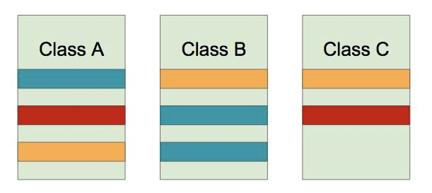
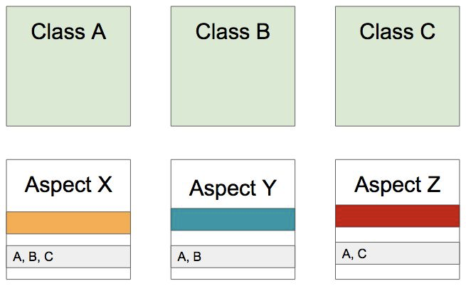
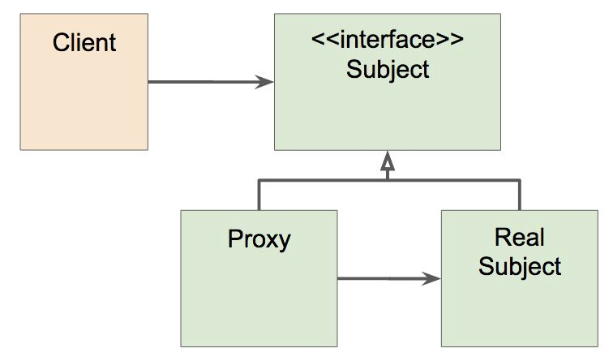

# Spring AOP

## 스프링 AOP: 개념 소개

Aspect-oriendted Programming (AOP)은 OOP를 보완하는 수단으로, 흩어진 Aspect를 모듈화 할 수 있는 프로그래밍 기법.

### 흩어진 관심사 (Crosscutting Concerns)



동일한 색이 동일한 Concern

트랜젝션, 로깅 → 와 같은 비슷한 기능이 각각의 클래스에 흩어져 있겠죠.

AOP를 적용하면?



각각 클래스로 생성, 독립적으로 따로 빼고 적용할 곳을 가지고 있음

### AOP 주요 개념

✔️ Aspect(하나의 모듈)와 Target(적용되는 대상)

✔️ Advice - 해야할 일들

✔️ Join point(합류점? 메서드 실행 시점, 실행할 때 끼어들 수 있는 지점, 생성자 호출 직전, 필드에 적용)와 Pointcut (어디에 적용해야 할지, 지점들)

### AOP 구현체

[🔗 Link](https://en.wikipedia.org/wiki/Aspect-oriented_programming)

✔️ 자바

- [AspectJ](https://en.wikipedia.org/wiki/AspectJ)  ← 다양한 기능
- 스프링 AOP ← 국한적인 기능

### AOP 적용 방법

**✔️ 컴파일**

: java → class, 조작된 바이트 코드를 생성

**✔️ 로드 타임**

: 클래스(Target)는 아주 순수하게 컴파일하고 그 클래스(Target)를 로딩하는 시점에 로드타임 위빙(끼어넣음)

로드타임 위버를 설정해야 함.

**→ 위의 두 개는 AspectJ**

**✔️ 런타임**

: Spring AOP가 하는 방식, Bean에 Aspect를 적용해야한다는 것을 알고있음. 클래스의 A Class라고 하면, A 타입의 프록시 빈을 만들어서 실제 A가 갖고 있는 메서드인 foo 를 불러오기 직전에
hello라는 일을 하고 A를 호출

빈을 생성할 때의 성능 비용. 다른 설정 없음

→ 이 방법이 가장 현실적이고 많이 선택

---

### 스프링 AOP: 프록시 기반 AOP

### 스프링 AOP 특징

✔️ **프록시 기반의 AOP** 구현체

✔️ **스프링 빈에만 AOP를 적용**할 수 있다.

✔️ 모든 AOP 기능을 제공하는 것이 목적이 아니라, 스프링 IoC와 연동하여 엔터프라이즈 애플리케이션에서 가장 흔한 문제에 대한 해결책을 제공하는 것이 목적.

### 프록시 패턴

✔️ 왜? (기존 코드 변경 없이) 접근 제어 또는 부가 기능 추가



프록시가 실제 주체를 감싸서 따로 역할 실행

✔️ 기존 코드를 건드리지 않고 성능을 측정해 보자. (프록시 패턴으로)

- Code (Cross Cutting Concern)

    ```java
    @Override
        public void createEvent() {
            long begin = System.currentTimeMillis();
    
            try {
                Thread.sleep(1000);
            } catch (InterruptedException e) {
                e.printStackTrace();
            }
            System.out.println("Create an event");
    
            System.out.println(System.currentTimeMillis() - begin);
            // cross cutting concern
        }
    ```

  기존의 코드를 건들여서 작동 타임을 확인하고 있음.

- Code : 위의 코드 변경 → **Proxy 생성**

    ```java
    @Primary
    @Service
    public class ProxySimpleEventService implements EventService {
    
        @Autowired
        SimpleEventService simpleEventService;
    
        @Override
        public void createEvent() {
            long begin = System.currentTimeMillis();
            simpleEventService.createEvent();
            System.out.println(System.currentTimeMillis() - begin);
        }
    
        @Override
        public void publishEvent() {
            long begin = System.currentTimeMillis();
            simpleEventService.publishEvent();
            System.out.println(System.currentTimeMillis() - begin);
        }
    }
    ```

### 문제점

✔️ **매번** 프록시 클래스를 작성해야 하는가?

✔️ **여러 클래스** 여러 메소드에 적용하려면?

✔️ 객체들 **관계도 복잡**하고...

동적으로 프록시 객체를 만드는 법이 있다.

이 방법을 기반으로 IoC 컨테이너가 제공하는 방법과 혼합해서 위 문제를 심플하게 해결할 수 있다.

**→ 스프링 AOP**

### 그래서 등장한 것이 스프링 AOP

✔️ 스프링 IoC 컨테이너가 제공하는 기반 시설과 Dynamic 프록시를 사용하여 여러 복잡한 문제 해결.

✔️ 동적 프록시: 동적으로 프록시 객체 생성하는 방법

- 자바가 제공하는 방법은 인터페이스 기반 프록시 생성.

- CGlib은 클래스 기반 프록시도 지원.

✔️ 스프링 IoC: 기존 빈을 대체하는 동적 프록시 빈을 만들어 등록 시켜준다.

- 클라이언트 코드 변경 없음.

- [AbstractAutoProxyCreator](https://docs.spring.io/spring-framework/docs/current/javadoc-api/org/springframework/aop/framework/autoproxy/AbstractAutoProxyCreator.html)
  implements [BeanPostProcessor](https://docs.spring.io/spring-framework/docs/current/javadoc-api/org/springframework/beans/factory/config/BeanPostProcessor.html)

→ 얘가 SimpleEventService(예제 코드 참조)와 같은 라는 빈을 감싸는 프록시 빈을 만들어준다.

토비의 스프링이 아주 자세히 설명한다.

---

## 스프링 AOP: @AOP

애노테이션 기반의 스프링 @AOP 의존성 추가

```xml
<dependency> 
		<groupId>org.springframework.boot</groupId> 
		<artifactId>spring-boot-starter-aop</artifactId>
</dependency>
```

### 애스팩트 정의

✔️ @Aspect

✔️ 빈으로 등록해야 하니까 (컴포넌트 스캔을 사용한다면) @Component도 추가.

```java
@Component
@Aspect
public class PerfAspect {
    // 2가지 정보가 필요 -> 해야할 일(advice), 어디에 적용할 것인가(pointcut)

    @Around("execution(* com.gngsn.springcore..*.EventService.*(..))") // 아래 logPerf라는 advice를 어디에 적용할 것인가 -> pointcut.
    // 해야할 일
    public Object logPerf(ProceedingJoinPoint pjp) throws Throwable {
        long begin = System.currentTimeMillis();
        // method invocation과 비슷한 개념. 메서드를 감싸고 있다.
        Object retVal = pjp.proceed();
        System.out.println(System.currentTimeMillis() - begin);
        return retVal;
    }
}
```

### 포인트컷 정의

✔️ @Pointcut(표현식)

✔️ 주요 표현식

- execution

- @annotation

- bean

✔️ 포인트컷 조합

- &&, ||, !

### 어드바이스 정의

✔️ @Before

✔️ @AfterReturning

✔️ @AfterThrowing

✔️ @Around

```java
// RetentionPolicy - 이 Annotation 정보를 어디까지 유지할 것인가
// .CLASS -> 클래스 파일까지만 정의하겠다 (default가 class)
@Retention(RetentionPolicy.CLASS)
@Documented
@Target(ElementType.METHOD)
public @interface PerfLogging {}

...

public class SimpleEventService implements EventService {
		@Around("@annotation(PerfLogging)")
		public Object logPerf(ProceedingJoinPoint pjp) throws Throwable {
			...
		}
}

...

public class SimpleEventService implements EventService {
		@PerfLogging
    public void createEvent() { ... }
}
```

`@Around("@annotation(PerfLogging)")` : PerfLogging 이라는 annotation를 사용한 곳을 범위로 갖는 Aspect

`@Around("bean(simpleEventService)")` : 생성된 bean으로 범위를 잡을 수도 있다.

`@Before("bean(simpleEventService)")` : method가 실행되기 전에 메서드가 실행됨

### 참고

✔️ [https://docs.spring.io/spring/docs/current/spring-framework-reference/core.html#aoppointcuts](https://docs.spring.io/spring/docs/current/spring-framework-reference/core.html#aoppointcuts)