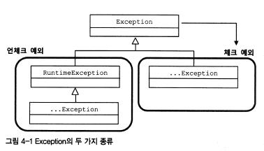

# 사라진 SQLException

스프링의 데이터 액세스 기능에 담겨있는 예외처리와 관련된 접근 방법에 대해 알아본다.

이를 통해 예외를 처리하는 베스트 프랙티스도 살펴본다.

<br/>

## 초난감 예외처리

### ✔️ 예외 블랙홀

아래는 기초를 배우는 학생들이 만들어낸 JDBC 코드에서 흔히 볼 수 있는 코드.

``` java
try {
    ...
} catch(SQLException e) {
} // 예외를 잡고 아무 처리도 없음. 정상적인 것처럼 다음 라인으로 넘어가겠다는 의도가 있는게 아니라면 연습 중에도 절대 만들어서는 안되는 코드
```

'*처리되지 않은 예외가 있다*'는 컴파일러 에러 표시도 사라지고, 간단한 예제라면 별 문제없이 잘(?) 작동한다.

예외가 발생하면 catch 블록을 써서 잡아내는 것까지는 졸은데 그리고 아무것도 하지 않고 별 문제 없는 것처럼 넘어가 버리는 건 정말 위험한 일이다.

<br/>

프로그램 실행 중 오류로 **예외가 발생했는데 무시하고 계속 진행해버리기 때문에** 원치 않는 예외가 발생하는 것보다도 훨씬 더 나쁜일이다.

비정상적인 동작, 메모리나 리소스가 소진, 예상치 못한 문제를 일으키는 등의 문제가 발생한다.

더 큰 문제는 **시스템 오류나 이상한 결과의 원인이 무엇인지 찾아내기 매우 힘들다는 점**이다.

<br/>

**📌 초난감 예외 처리 코드 2**

<div style="display: flex;">
<div width="100%; margin-right: 10px;">

``` java
} catch(SQLException e) {
    System.out.println(e);
}
```
</div>
<div width="100%">

``` java
} catch(SQLException e) {
    System.out.println(e);
}
```
</div>
</div>

개발 중에는 IDE 콘솔이나 서버 실행창에 이 메시지가 눈에 띄어도 다른 로그나 메시지에 금방 묻혀버리면 놓치기 쉽상이다. 

운영 서버에 올라가면 더욱 심각하다.

이렇게 화면에 메시지를 출력한 것은 예외를 처리한 것이 아니다. 

<br/>

> **예외를 처리할 때 반드시 지켜야 할 핵심 원칙**
>
> ✔️ 적절하게 복구되던지, 
> 
> ✔️ 작업을 중단 시키고 운영자 또는 개발자에 분명하게 통보되어야 한다.

<br/>

### 무의미하고 무책임한 `throws`

예외를 일일이 catch하기 귀찮고, 별 필요도 없으며 매번 정확하게 예외 이름을 적어서 선언하기도 귀찮으니 아예 `throws Exception`이라는, 모든 예외를 무조건 던져버리는 선언을 모든 메소드에 기계적으로 넣는 개발자들이 있다.

이런 무책임한 `throws` 선언도 심각한 문제점이 있다.

실제로 실행 중에 예외적인 상황이 발생할 수 있다는 것인가? 아님 그냥 습관적으로 복사해서 붙여놓은 것인가? 알 수 없다.

<br/>

결과적으로 **적절한 처리를 통해 복구될 수 있는 예외 상황도 제대로 다룰 수 있는 기회를 박탈**당한다.

<br/>
<br/>

## 예외의 종류와 특징


자바에서 `throws`를 통해 발생시킬 수 있는 예외는 크게 세 가지가 있다.

<br/>

### 📌 Error

> *`java.lang.Error` 클래스의 서브클래스*
> 
> Error는 시스템에 비정상적인 상황이 발생했을 경우에 사용

<br>

Error는 주로 **자바 VM**에서 발생시키는 것이고 애플리케이션 코드에서 잡으려고 하면 안된다. 

`OutOfMemoryError`나 `ThreadDeath` 같은 에러는 catch 블록으로 잡아봤자 아무런 대응 방법이 없기 때문이다. 

따라서, 시스템 레벨에서 특별한 작업을 하는 게 아니라면 애플리케이션에서는 이런 에러에 대한 처리는 신경 쓰지 않아도 된다.

<br/>

### 📌 Exception과 체크 예외

<br>

> *`java.lang.Exception` 클래스의 서브클래스*
> 
> Error와는 다르게 개발자들이 만든 **애플리케이션 코드의 작업 중에 예외상황**이 발생했을 경우에 사용

<br>

Exception 클래스는 체크 예외와 언체크 예외로 구분된다. 

 

<br><br>

**✔️ Checked Exception**

- `Exception` Class의 서브클래스이면서 RuntimeException Class를 상속하지 않은 것

- 일반적으로 자바에서 예외라고 하는 것에 해당

<br>

`RuntimeException`은 `Exception`의 서브클래스이므로 `Exception`의 일종이긴 하지만 자바는 `RuntimeException`과 그 서브클래스를 특별하게 다룬다.

체크 예외가 발생할 수 있는 메소드를 가용할 경우 반드시 예외를 처리하는 코드를 함께 작성해야 한다.

catch 문으로 잡든지, 아니면 다시 `throws`를 정의해서 메소드 밖으로 던져야 한다.

그렇지 않으면 컴파일 에러가 발생한다. 

<br>

체크 예외를 발생가능한 예외에 모두 적용하려고 했던 것 같다. 

그래서 `IOException`이나 `SQLException`을 비롯해서 예외적인 상황에서 던져질 가능성이 있는 것들 대부분이 체크 예외로 만들어 졌다.

<br><br>

### 📌 RuntimeException과 언체크/런타임 예외

**✔️ Unchecked Exception**

- `Exception` Class의 서브클래스이면서 RuntimeException Class를 상속하지 않은 것

- 피할 수 있지만 개발자가 부주의해서 발생할 수 있는 경우에 발생하도록 만든 것

- **런타임 예외**라고도 불림 

<br>

명시적인 예외처리를 강제하지 않기 때문에 언체크 예외라고 불린다.

대표 클래스 이름을 따서 런타임 예외라고도 한다. 

이 런타임 예외는 catch 문이나 아니면 `throws`로 선언해줘도, 안해줘도 상관없다.

<br><br>

**✍🏻 주로 프로그램의 오류가 있을 때 발생하도록 의도된 것**

대표적으로 오브젝트를 할당하지 않은 레퍼런스 변수를 사용하려고 시도했을 때 발생하는 `NullPointerException이나`, 

허용되지 않는 값을 사용해서 메소드를 호출할 때 발생하는 `IllegalArgumentException` 등이 포함된다.

피할 수 있지만 개발자가 부주의해서 발생할 수 있는 경우에 발생하도록 만든 것이 런타임 예외이며, 코드에서 미리 조건을 체크하도록 주의 깊게 만든다면 피해갈 수 있다.

<br><br>

체크 예외의 불필요성을 주장하는 사람들이 늘어나고 예외 블랙홀이나 무책임한 `throws` 같은 코드가 남발되며

최근 새로 등장하는 자바 표준 스펙의 API들은 예상 가능한 예외상황을 다루는 예외를 체크 예외로 만들지 않는 경향이 있다.

<br><br>

## 예외 처리 방법

예외 처리의 일반적인 방법을 살펴보고 효과적인 예외처리 전략을 생각해보자.

<br>

### 예외 복구

> ✔️ 예외상황을 파악하고 문제를 해결해서 정상 상태로 돌려놓는 것

IOException이 발생했을 때, 사용자에게 상황을 알려주고 다른 파일을 이용하도록 안내해서 예외상황을 해결할 수 있다.

-> 다른 작업 흐름으로 자연스럽게 유도

<br>

**Ex 1. IOException**

IOException 에러 메시지를 사용자에게 그냥 던지는 건 예외 복구라고 볼 수는 없고, 

비록 사용자에게 예외 상항으로 비쳐도 애플리케이션에서는 정상적으로 설계된 흐름을 따라 진행돼야 한다.

<br>

**Ex 1. SQLException**

네트워크의 불안으로 발생한 SQLException 발생하는 경우에는 재시도를 해볼 수 있다.

일정 시간 대기했다가 다시 접속을 시도해보는 방법. (시도 횟수 제한 MAX_RETRY -> 예외 복구 포기 시점 정하기)

예외 처리 코드를 강제라는 체크 예외들은 이렇게 예외를 어떤 식으로든 복구할 가능성이 있는 경우에 사용한다.

예외 상황이 발생할 수 있음을 인식하도록 도와주고 이에 대한 적절한 처리를 시도해보도록 요구하는 것이다.

<br>

``` java

int MAX_RETRY = 3;
while(MAX_RETRY --> 0) {
    try {
        ...                         // 예외가 발생할 가능성이 있는 시도
        return;                     // 작업 성공
    } catch (SomeException e) {
        // 로그 출력. 정해진 시간만큼 대기
    } finally {
        // 리소스 반납. 정리 작업
    }
}
throw new RetryFailedException();  // 최대 재시도 횟수를 넘기면 직접 예외 발생

```

<br><br>


### 예외 처리 회피

> ✔️ 예외 처리를 자신을 호출한 쪽으로 던지는 것

<br>

`throws` 문으로 선언해서 예외가 발생하면 알아서 던져지게 하거나 catch 문으로 일단 예외를 잡은 후에 로그를 남기고 다시 예외를 던지는<small>rethrow</small>것이다.

예외처리를 회피하려면 반드시 다른 오브젝트나 메소드가 예외를 대신 처리할 수 있도록 아래와 같이 던져야한다.


``` java
public void add() throws SQLException {
    // JDBC API
}
```

``` java
public void add() throws SQLException {
    try {
        // JDBC API
    } catch (SQLException e) {
        // 로그 출력
        throw e;
    }
}
```

<br>

**✔️ 회피 처리 예시**

JdbcContext나 JdbcTemplate이 사용하는 콜백 오브젝트는 메소드 선언을 보면 알겠지만 `ResultSet`이나 `PreparedStatement` 등을 이용해서 작업하다 발생하는 `SQLException`을 자신이 처리하지 않고 템플릿으로 던져버린다.

콜백 오브젝트의 메소드는 모두 `throws SQLException`이 붙어 있다. `SQLException`을 처리하는 일은 콜백 오브젝트의 역할이 아니라고 보기 때문이다. 콜백 오브젝트의 메소드는 `SQLException`에 대한 예외를 회피라고 템플릿 레벨에서 처리하도록 던져준다.

<br>

**✔️ 회피하면 안되는 상황**

콜백과 템플릿처럼 긴밀하게 역할을 분담하고 있는 관계가 아니라면 자신의 코드에서 발생하는 예외를 그냥 던져버리는 건 무책임한 책임회피가 될 수 있다.

예를 들어보자. 

DAO가 `SQLException`을 생각없이 던져버리면 어떨까. 서비스 계층 메소드가 받아서 다시 던지고, 컨트롤러도 다시 던지도록 선언해서 예외는 그냥 서버로 전달되고 말 것이다.

<br><br>


### 예외 전환

*Exception translation*

<br>

예외 회피와 비슷하게 예외를 복구해서 정상적인 상태를 만들 수 없기 때문에 예외를 메소드 밖으로 던지는 것이다.

하지만 예외 회피와는 달리, **적절한 예외로 전환**해서 던진다.

<br>

**예외 전환의 두 가지 목표**

<details>
<summary> 1. 의미를 분명하게 해줄 예외로 바꾸는 것 </summary>

<br>

내부에서 발생한 예외를 그대로 던지는 것이 그 예외상황에 대한 적절한 의미를 부여해주지 못하는 경우, 

의미를 분명하게 해줄 수 있는 예외로 바꿔주기 위해서 사용한다.

API가 발생하는 기술적인 로우레벨을 상황에 적합한 의미를 가진 예외로 변경하는 것이다.

<br>

예를 들어 회원가입 로직에서 '*이미 사용하는 아이디 사용자가 존재*'하는 경우로 DB 에러가 발생했다고 생각해보자. 

이 에러를 DAO에서 그냥 던지면 왜 SQL Exception이 발생한지 모른다. 

이럴 땐 DuplicateUserIdException 같은 예외로 바꿔서 던져주는 게 좋다.

<br>

**서비스 계층에서도 할 수 있지만, 특정 기술의 정보를 해석하는 코드를 비즈니스 로직을 담은 서비스 계층에 두는 건 매우 어색하기 때문에 DAO 메소드에서 기술에 독립적이며 의미가 분명한 예외로 전환해서 던져줄 필요가 있다.**

``` java
 public void add(User user) throws DuplicateUserIdException, SQLException {
     try {
         // JDBC를 이용해 user 정보를 DB에 추가하는 코드 또는
         // 그런 기능을 가진 다른 SQLException을 던지는 메소드를 호출하는 코드
     } catch (SQLException e) {
         // ErrorCode가 MySQL의 "Duplicte Entry(1062)"이면 예외 전환
         if (e.getErrorCode() == MySqlErrorNumbers.ER_DUP_ENTRY)
             throw DuplicateUserIdException();
         else
             throw e;  // 그 외의 경우는 SQLException 그대로
     }
 }
```

<br>

보통 전환하는 예외에 원래 발생한 예외를 담아서 아래처럼 중첩 예외<small>nested exception</small>로 만드는 것이 좋다.

``` java
catch(SQLException e) {
    ...
    throw DuplicateUserIdException(e);
    // or
    throw DuplicateUserIdException().initCause(e);
}
```
<small><i>👆🏻 중첩 예시 </i></small>

</details>
<details>
<summary> 2. 예외를 처리하기 쉽고 단순하게 만들기 위해 포장<small>wrap</small>하는 것 </summary>

<br>

중첩 예외를 이용해 새로운 예외를 만들고 원인<small>cause</small>이 되는 예외를 내부에 담아서 던지는 방식은 같다.

하지만, 의미를 명확하게 하려고 다른 예외로 전환하는 것이 아니고, 주로 **예외처리를 강제하는 체크 예외를 언체크 예외(런타임 예외)로 바꾸는 경우**에 사용한다.

대표적으로 EJBException는 비즈니스 로직으로 볼 때 의미 있는 예외이거나 복구 가능한 예외가 아니다.

이 경우에는 런타임 예외인 EJBException으로 포장해서 던지는 편이 낫다.

``` java
try {
    OrderHome orderHome = EJBHomeFactory.getInstance().getOrderHome();
    Order order = orderHome.findByPrimaryKey(Integer id);
} catch (NamingException ne) {
    throw new EJBException(ne);
} catch (SQLException se) {
    throw new EJBException(se);
} catch (RemoteException re) {
    throw new EJBException(re);
}
```

EJBException는 RuntimeException 클래스를 상속한 런타임 예외다.

이렇게 **런타임 예외로 만들어서 전달하면 EJB는 이를 시스템 익셉션으로 인식하고 트랜잭션을 자동으로 롤백**해준다.

어차피 복구가 불가능한 예외라면 가능한 한 빨리 런타임 예외로 포장해 던지게 해서 다른 계층의 메소드를 작성할 때 불필요한 `throws` 선언이 들어가지 않도록 해줘야 한다. 

</details>

<br/>

어차피 복구하지 못할 예외라면 애플리케이션 코드에서는 런타임 예외로 포장해서 던져버리자.

✔️ 예외처리 서비스 등을 이용해 자세한 로그

✔️ 관리자에게는 메일 등으로 통보 

✔️ 사용자에게는 친절한 안내 메시지를 보여주기

위와 같이 처리하는 게 바람직하다.

<br><br>

## 예외처리 전략

일반적으로는 체크 예외가 일반적인 예외를 다루고, 언체크 예외는 시스템 장애나 프로그램상의 오류에 사용한다고 했다.

하지만 점점 체크 예외의 활용도와 가치는 점점 떨어지고 있고, 

**대응이 불가능한 체크 예외라면 빨리 언타임 예외로 전환해서 던지는 게 낫다.**

<br>

### 예외처리 예시 - DuplicatedUserIdException

위에서 보았던 add 메소드는 DuplicatedUserIdException와 SQLException, 두 가지 체크 예외를 던지게 했다.

``` java
    public void add(User user) throws DuplicateUserIdException, SQLException {}
```


위와 같이 ID 중복은 의미 있는 예외인 DuplicateUserIdException로 전환해주고, 아니라면 SQLException를 그대로 던지게 했다.

DuplicateUserIdException은 앞 단에서 대응할 수 있는 예외이기 때문에 잡아서 대응할 수 있지만,

SQLException은 대부분 복구 불가능한 예외이기 때문에 잡아봤자 처리할 것도 없고, `throws`를 계속 던지다가 애플리케이션 밖으로 던져질 것이다.

DuplicateUserIdException을 잡아서 처리할 수 있다면 굳이 체크 예외로 만들지 않고 런타임 예외로 만드는 게 낫다. 

대신 add() 메소드는 명시적으로 DuplicateUserIdException을 던진다고 선언해야 한다.

그래야 add() 메소드를 사용하는 코드를 만드는 개발자에게 의미 이쓴ㄴ 정보를 전달해줄 수 있다. 

런타임 예외도 `throws`로 던질 수 있으니 문제 될 것은 없다.

코드를 수정해보면 아래와 같다.

``` java
public class DuplicateUserIdException extends RuntimeException {
    public DuplicateUserIdException(Throwable cause) {
        super(cause);
    }
}
```
``` java
public void add(User user) throws DuplicateUserIdException {
        try {
            // JDBC를 이용해 user 정보를 DB에 추가하는 코드 또는
            // 그런 기능을 가진 다른 SQLException을 던지는 메소드를 호출하는 코드
        } catch (SQLException e) {
            if (e.getErrorCode() == MysqlErrorNumbers.ER_DUP_ENTRY) // MySQL 전용 코드 - 호환성 제한
                throw new DuplicateUserIdException(e);              // 예외 전환
            else
                throw new RuntimeException(e);                      // 예외 포장
        }
    }
```

SQLException를 처리하기 위해 불필요한 `throws`를 없애고, 필요한 경우 아이디 중복 상황을 처리하기 위해 DuplicateUserIdException을 이용할 수 있다. 


이렇게 런타임 예외를 일반화해서 사용하는 방법은 여러모로 장점이 많지만, 런타임 예외로 만들었기 때문에 사용에 더 주의를 기울일 필요도 있다.

컴파일러가 예외처리흫 강제하지 않으므로로 신경쓰지 않으면 예외 상황을 출분히 고려하지 않을 수도 있기 때문이다.
런타임 예외를 사용하는 경우에는 API 문서나 레퍼런스 문서등을 통해 메소드를 사용할 때 발생할 수 있는 예외의 종류와 원인, 활용 방법을 자세히 설명해두자.

<br><br>

### 애플리케이션 예외

런타임 예외 -> 낙관적인 예외와 가깝다. 

복구할 수 있는 예외는 없다고 가정하고 예외가 생겨도 어차피 런타임 예외이므로 시스템 레벨에서 알아서 처리해줄 것이고, 필요한 경우에 잡아서 복구하거나 대응할 수 있기 때문

<br>

**애플리케이션 예외**

: 시스템 또는 외부의 예외 상황이 원인이 아니라 애플리케이션 자체의 로직에 의해 의도적으로 발생시키고, 반드시 catch해서 무엇인가 조치를 취하도록 요구하는 예외

<br>

예를 들어 은행 시스템에서 출금을 요청하는 사용자가 있을 때, 사용자의 잔액을 먼저 확인해야 한다.

허용 범위를 넘으면 출금 작업을 중단하고 적절한 경고를 사용자에게 보내야 한다. 

처리 방법에는 아래 두 가지가 있다.

<br>

- **성공/실패 경우 각각 다른 종류의 리턴 값 반환**

예를 들어 실패 시 -1이나 0 등의 특별히 정한 특정 값을 반환한다. 

물론 시스템 오류가 아니기 때문에 두 가지 모두 정상 흐름이다.

<br>

하지만, 사전에 상수로 정의해둔 표준 코드를 사용하지 않는다면 자칫 개발자 사이의 의사소통 문제로 인해 제대로 동작하지 않을 위험이 있기 때문에

예외 상황에 대한 리턴 값을 명확하게 코드화하고 잘 관리하지 않으면 혼란이 생길 수 있다.

예외상황에서의 결과 값에 대한 표준 값이 존재하지 않고, 개발자 간의 의사소통이 미흡해 문제가 생길 수 있다.

또, if 블록으로 범벅된 코드가 될지도 모른다.


<br>

- **비즈니스적인 의미를 띤 예외를 던지기**

예를 들어 잔고 부족과 같은 경우라면, InsufficientBalanceException 등을 던질 수 있다. 

번거로운 if 문을 남발하지 않아도 된다.

이때 사용하는 예외는 의도적으로 **체크 예외**로 만든다.

그래서 개발자가 잊지 않고 잔고부족처럼 자주 발생할 수 있는 예외 상황에 대한 로직을 구현하도록 강제해주는 것이 좋다.

무책임한 `throws`로 이뤄질 수도 있지만, 런타임 예외로 만들어두는 것보다는 상대적으로 안전하다.

<br><br>

### SQLException

`SQLException`은 99%는 코드 레벨에서 복구할 방법이 없다. 

프로그램 오류나 개발자의 부주의 때문에 발생하는 경우거나 통제 불가능한 상황으로 인해 발생한다.

<small>DB 서버 다운, 불안정한 네트워크, 가득찬 DB 커넥션 풀로 인해 사용 불가 등 ...</small>

그래서 언체크/런타임 예외로 전환해줘야 한다.

`JdbcTemplate`은 모든 `SQLException`을 런타임 예외인 `DataAccessException`으로 포장해서 던져준다.

때문에 필요한 경우에만 `DataAccessException`을 잡아서 처리할 수 있다.


``` java
public interface JdbcOperations {
    ...

    <T> T query(String sql, ResultSetExtractor<T> rse) throws DataAccessException;

    int update(String sql) throws DataAccessException;

    ...
}
```
<br>

위와 같이 모든 메서드에서 `DataAccessException`를 던지는 것을 확인할 수 있다.

<br>

이 밖에도 스프링의 API메소드에 정의되어 있는 대부분의 예외는 런타임 예외다.

따라서 발생 가능한 예외가 있다고 하더라도 이를 처리하도록 강제하지는 않는다. 

<br><br><br>

# 예외 전환

예외 전환의 목적 

- 런타임 예외로 포장 -> catch/throws 줄이기 위함
- 로우레벨의 예외를 의미있고 추상화된 예외로 바꾸기 위함

<br>

커스텀 예외인 `DuplicateUserIdException`를 처리하고 싶다면 `DuplicateKeyException` **예외를 전환**해주는 코드를 넣을 수 있다.

``` java
public void add() throws DuplicateUserIdException {
    try {
        // JDBC를 이용해 user 정보를 DB에 추가하는 코드
    } catch (DuplicateKeyException e) {
        // logging 등 필요 작업
        throw new DuplicateUserIdException(e);
    }
}
```

<br>

## 정리

- 예외를 잡아서 아무런 조취를 취하지 않거나 의미 없는 throws 선언을 남발하는 것은 위험 하다.
- 예외는 복구하거나 예외처리 오브젝트로 의도적으로 전달하거나 적절한 예외로 전환해야 한다.
- 좀 더 의미 있는 예외로 변경하거나, 불필요한 catch/throws 를 피하기 위해 런타임 예외로 포장하는 두 가지 방법의 예외 전환이 있다. 
- 복구할 수 없는 예외는 가능한 한 빨리 런타임 예외로 전환하는 것이 바람직하다. 
- 애플리케이션의 로직을 담기 위한 예외는 체크 예외로 만든다. 
- JDBC의 SQLException 은 대부분 복구할 수 없는 예외이므로 런타임 예외로 포장해야 한다.
- SQLException 의 에러 코드는 DB에 종속되기 때문에 DB에 독립적인 예외로 전환될 필요가 있다.
- 스프링은 DataAccessException 을 통해 DB에 독립적으로 적용 가능한 추상화된 런타임 예외 계층을 제공한다.
- DAO를 데이터 액세스 기술에서 독립시키려면 인터페이스 도입과 런타임 예외 전환, 기술에 독립적인 추상화된 예외로 전환이 필요하다.

<br><br>


---


*추가할 내용*

## 트랜잭션


| | Checked Exception | Unchecked Exception |
|--| ----------------- | ----------------- |
| Compile Error 여부 | 반드시 예외 처리 해야함 (처리하지 않으면 Compile Error) | 예외 처리 하지 않아도됨 |
| 트랜잭션 | Rollback X | Rollback O |
| ex | IOException, SQLException | NullPointerException, IllegalArgumentException |
